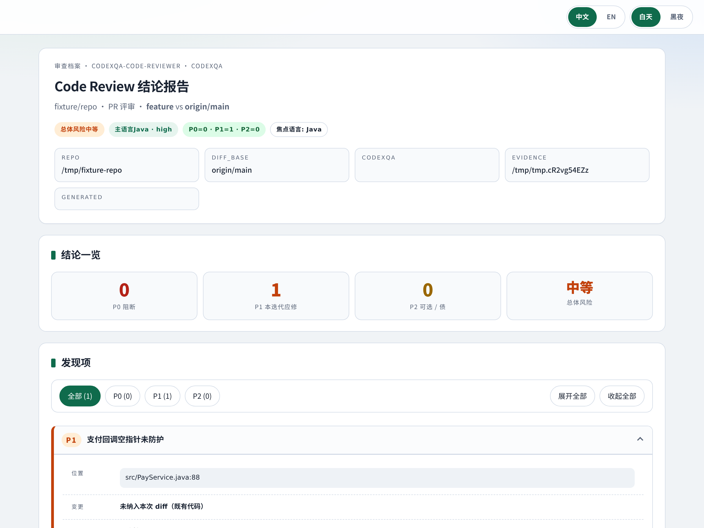
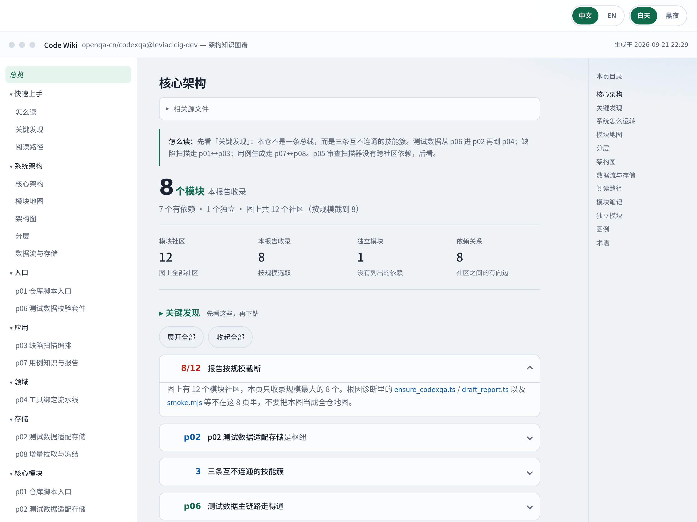
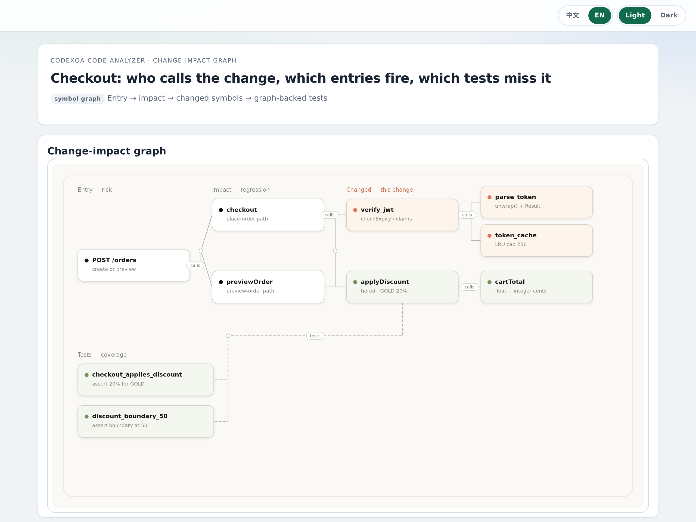
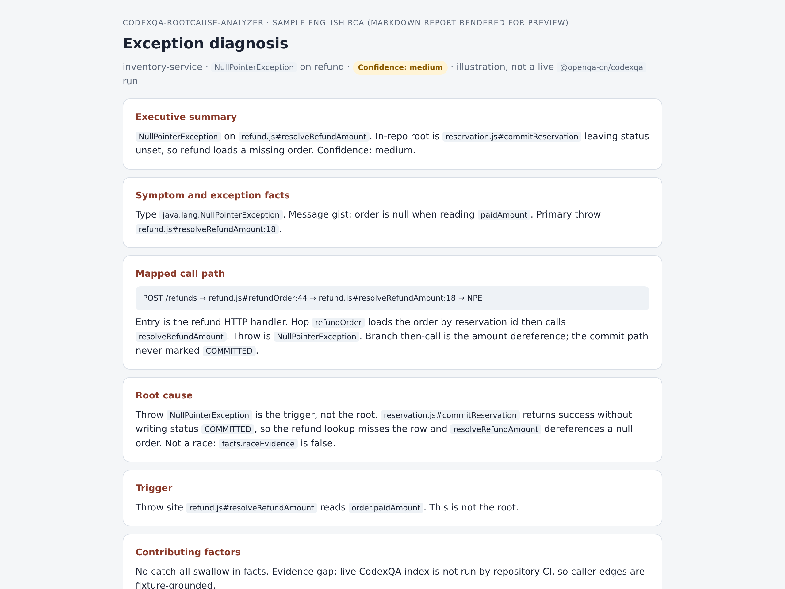
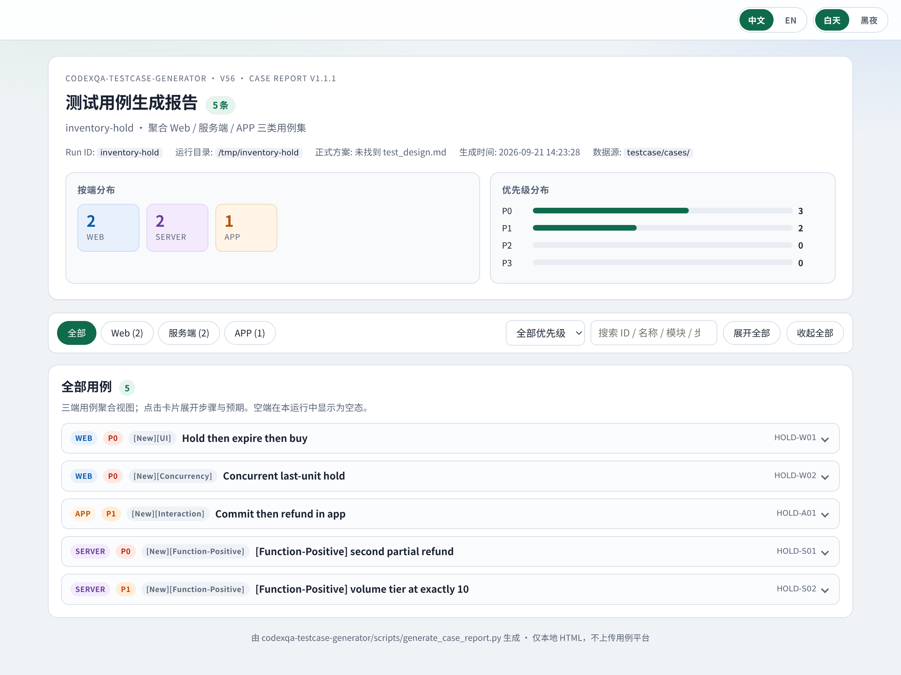

<div align="center">

<a id="readme-en"></a>

# CodexQA

**Shipping fast is table stakes. CodexQA runs fully local, installs ready to use, and tells you if the code is good.**

After AI coding, the hard part is **verifying quality before you merge**: bugs in what just landed, blast radius on old features, complete test cases, the change knowledge graph (which APIs, methods, and call chains moved), whether architecture broke, security risk, requirement fit, and test data you can actually run. **CodexQA** is built for that **test-and-verify stage** — 8 Agent Skills (+ a router), 360° coverage, so you not only write fast, you **see fast whether it is good**, and the development loop actually closes.

Cursor · Claude Code · Codex · OpenClaw. Fully local. Install and use — no account, no gateway, no QA-platform move.

<p>
  <strong>8</strong> skills &nbsp;·&nbsp;
  <strong>0</strong> accounts &nbsp;·&nbsp;
  <strong>7/7</strong> blind recall &nbsp;·&nbsp;
  <strong>0</strong> decoy FPs &nbsp;·&nbsp;
  <strong>10</strong> languages
</p>

<sub>Recorded JS blind eval on <a href="examples/inventory-service/README.md">inventory-service</a>: 7 planted semantic defects, 4 decoys. Recall 7/7, precision 7/7, 0 trap FPs — Composer, 2026-09-08, <em>one run, not a multi-model benchmark</em>. Semgrep seeds: 102 rules / 10 languages.</sub>

GitHub is the skill source; product site: [openqa.cn](https://openqa.cn/?utm_source=github&utm_medium=readme&utm_campaign=oss-seo&utm_content=hero).

[](https://github.com/openqa-cn/codexqa/actions/workflows/repo-check.yml)
[](https://openqa.cn/?utm_source=github&utm_medium=readme&utm_campaign=oss-seo&utm_content=badge-docs)
[](https://github.com/openqa-cn/codexqa/releases)
[](https://github.com/openqa-cn/codexqa/commits)
[](https://github.com/openqa-cn/codexqa/graphs/commit-activity)
[](https://github.com/openqa-cn/codexqa/stargazers)
[](LICENSE)

**English | [简体中文](#readme-zh)**

<a href="https://openqa.cn/?utm_source=github&utm_medium=readme&utm_campaign=oss-seo&utm_content=nav-docs"><strong>Documentation</strong></a> ·
<a href="#quick-start"><strong>Quick Start</strong></a> ·
<a href="#overview-of-all-skills"><strong>Skills overview</strong></a> ·
<a href="docs/GETTING_STARTED.md"><strong>Install notes</strong></a> ·
<a href="CHANGELOG.md"><strong>Changelog</strong></a>

</div>

<a id="what-the-output-looks-like"></a>
<a id="overview-of-all-test-and-verify-skills"></a>

## Overview of all skills

<table>
<tr>
<td width="50%" valign="top">
<p><strong><a href="skills/codexqa-defect-analyzer/README.md">codexqa-defect-analyzer</a></strong></p>
<p><strong>Verifies</strong> — whether the code you just wrote or merged hides bugs or security issues a quick glance would miss.</p>
<p><strong>Does</strong> — merges SAST / lint / secrets with one Agent semantic pass into a P0–P3 HTML report: location, evidence, suggestion.</p>
<p align="center"><a href="https://htmlpreview.github.io/?https://github.com/openqa-cn/codexqa/blob/main/docs/assets/previews/defect-report.html"></a></p>
</td>
<td width="50%" valign="top">
<p><strong><a href="skills/codexqa-code-reviewer/README.md">codexqa-code-reviewer</a></strong></p>
<p><strong>Verifies</strong> — whether this change is merge-ready, and whether it silently hits old behavior. A git diff alone rarely shows call chains or test gaps.</p>
<p><strong>Does</strong> — collects a CodexQA evidence pack (callers, blast radius, test edges), then writes a bilingual <code>REVIEW-REPORT.html</code> you can send to a reviewer.</p>
<p align="center"><a href="https://htmlpreview.github.io/?https://github.com/openqa-cn/codexqa/blob/main/docs/assets/previews/review-report.html"></a></p>
</td>
</tr>
<tr>
<td width="50%" valign="top">
<p><strong><a href="skills/codexqa-code-wiki/README.md">codexqa-code-wiki</a></strong></p>
<p><strong>Verifies</strong> — how the repo is actually layered, which module is the hub, and where a newcomer (or an Agent) should start reading. Without a map, “did we break the architecture?” is a guess.</p>
<p><strong>Does</strong> — builds a local architecture knowledge graph — communities, real dependencies, reading paths — as openable HTML, not a chat summary.</p>
<p align="center"><a href="https://htmlpreview.github.io/?https://github.com/openqa-cn/codexqa/blob/main/docs/assets/previews/code-wiki.html"></a></p>
</td>
<td width="50%" valign="top">
<p><strong><a href="skills/codexqa-code-analyzer/README.md">codexqa-code-analyzer</a></strong></p>
<p><strong>Verifies</strong> — which APIs, methods, and call chains this change actually hits; what to regression-test; which paths still have no tests.</p>
<p><strong>Does</strong> — queries a local symbol graph for callers, entries, and untested edges. Not a full-text search guess.</p>
<p align="center"><a href="https://htmlpreview.github.io/?https://github.com/openqa-cn/codexqa/blob/main/docs/assets/previews/code-analyzer.html"></a></p>
</td>
</tr>
<tr>
<td width="50%" valign="top">
<p><strong><a href="skills/codexqa-rootcause-analyzer/README.md">codexqa-rootcause-analyzer</a></strong></p>
<p><strong>Verifies</strong> — after mapping a stack or log back onto the repo, where the failure really starts. The throw site is often not the root cause.</p>
<p><strong>Does</strong> — writes a gated English RCA: trigger vs root cause vs confidence, plus one fix-and-verify suggestion.</p>
<p align="center"><a href="https://htmlpreview.github.io/?https://github.com/openqa-cn/codexqa/blob/main/docs/assets/previews/rootcause.html"></a></p>
</td>
<td width="50%" valign="top">
<p><strong><a href="skills/codexqa-requirement-analyzer/README.md">codexqa-requirement-analyzer</a></strong></p>
<p><strong>Verifies</strong> — whether the requirement is testable, complete, and internally consistent — before anyone writes code. Gaps and conflicts often live in the PRD.</p>
<p><strong>Does</strong> — one P0/P1 gap-and-conflict register from a PRD (or a multi-source pack). High-priority items come with executable verification steps.</p>
<p align="center"><a href="https://htmlpreview.github.io/?https://github.com/openqa-cn/codexqa/blob/main/docs/assets/previews/ra-register.html"></a></p>
</td>
</tr>
<tr>
<td width="50%" valign="top">
<p><strong><a href="skills/codexqa-testcase-generator/README.md">codexqa-testcase-generator</a></strong></p>
<p><strong>Verifies</strong> — what a complete test pass should cover for Web / server / APP, without inventing business facts when the PRD is silent.</p>
<p><strong>Does</strong> — local Markdown plan + cases (unknowns stay TBD) plus an aggregated HTML you can open. No test-management platform.</p>
<p align="center"><a href="https://htmlpreview.github.io/?https://github.com/openqa-cn/codexqa/blob/main/docs/assets/previews/testcase-report.html"></a></p>
</td>
<td width="50%" valign="top">
<p><strong><a href="skills/codexqa-testdata-generator/README.md">codexqa-testdata-generator</a></strong></p>
<p><strong>Verifies</strong> — whether the preconditions in a case can actually be built on a real backend. A copied fake ID will not pass a real API.</p>
<p><strong>Does</strong> — constructs data against the backend and writes the returned business IDs back into case preconditions. Success means the backend issued an ID.</p>
<p align="center"><a href="https://htmlpreview.github.io/?https://github.com/openqa-cn/codexqa/blob/main/docs/assets/previews/testdata-writeback.html"></a></p>
</td>
</tr>
</table>

<a id="evidence-and-limitations"></a>

<a id="quick-start"></a>

## Quick start

**1. Install** (router only is enough; it can fetch a worker on demand):

```bash
npx skills add openqa-cn/codexqa --skill codexqa-skill-router
```

Pick Cursor, Claude Code, Codex, or OpenClaw when prompted. No npm login.

Zero-model install check:

```bash
node examples/checkout-boundary/verify.mjs
```

**2. Run** — new Agent session, then paste:

```text
I am not sure which skill to use. Route this: review this repo against origin/main
and produce an openable HTML report I can send to a reviewer.
```

Or name a worker: `Use codexqa-defect-analyzer on this branch. Requirement: a refund must not exceed the remaining refundable balance.`

**3. See a report** — the Agent writes HTML/Markdown on disk. Compare with the screenshots above.

**Install a specific skill · code-graph CLI**

```bash
npx skills add openqa-cn/codexqa --skill codexqa-defect-analyzer
npx skills add openqa-cn/codexqa --skill codexqa-code-reviewer
npx skills add openqa-cn/codexqa --skill codexqa-code-wiki
npx skills add openqa-cn/codexqa --skill codexqa-code-analyzer
npx skills add openqa-cn/codexqa --skill codexqa-rootcause-analyzer
npx skills add openqa-cn/codexqa --skill codexqa-requirement-analyzer
npx skills add openqa-cn/codexqa --skill codexqa-testcase-generator
npx skills add openqa-cn/codexqa --skill codexqa-testdata-generator
```

## Capabilities

Each skill is one step in the test-and-verify loop. The table says **when to use it** and **what checkable result** you leave with — an openable artifact, not a chat summary.

| | Skill | When to use it, and what verification result you get |
| --- | --- | --- |
| 🧭 | [`codexqa-skill-router`](skills/codexqa-skill-router/README.md) | **When** you are not sure whether you need a defect scan, impact map, cases, or test data — or the worker is not installed yet.<br>**You get** the matching skill, installed on demand if missing, then a handoff. Verification starts by picking the right tool; you do not memorize eight entry points. |
| 📋 | [`codexqa-requirement-analyzer`](skills/codexqa-requirement-analyzer/README.md) | **When** a PRD, story pack, or mixed materials land, before anyone writes code: is it testable, complete, internally consistent?<br>**You get** one assignable P0/P1 gap-and-conflict register. High-priority rows include preconditions, stimulus, expected result, and evidence — the requirement-layer blockers that would make later testing fail. |
| 🧪 | [`codexqa-testcase-generator`](skills/codexqa-testcase-generator/README.md) | **When** you need a test plan and executable cases for Web / server / APP before submit, or extra regression after a change.<br>**You get** local Markdown plan + cases + aggregated HTML: which scenarios, which priority. Unknowns stay TBD; silent PRD gaps are not invented as fake cases. |
| 🗃️ | [`codexqa-testdata-generator`](skills/codexqa-testdata-generator/README.md) | **When** cases exist but will not run: missing accounts, catalog rows, orders. A copied fake ID will not pass a real API.<br>**You get** data constructed against the backend, with returned business IDs written into case preconditions. Success means the backend issued an ID, not that a number appeared in chat. |
| 🗺️ | [`codexqa-code-wiki`](skills/codexqa-code-wiki/README.md) | **When** a newcomer or an Agent enters the repo, or you are reviewing whether a change broke the architecture.<br>**You get** an architecture knowledge-graph HTML: module communities, real dependencies, the hub, a reading path. You are checking layering and where to start — not another README. |
| 📈 | [`codexqa-code-analyzer`](skills/codexqa-code-analyzer/README.md) | **When** you review a PR, set regression scope, or ask “who does this change hit?” A git diff will not show call chains.<br>**You get** blast radius from a local symbol graph: which APIs / methods / call chains moved, which entries fire, which edges have no tests. That list is what you regression-test. |
| 🧯 | [`codexqa-rootcause-analyzer`](skills/codexqa-rootcause-analyzer/README.md) | **When** a production or local exception, stack, or log still does not tell you which layer actually failed.<br>**You get** a gated English RCA: trigger vs root cause vs confidence, plus one fix-and-verify suggestion. The throw site is not treated as the root cause. |
| 🛡️ | [`codexqa-defect-analyzer`](skills/codexqa-defect-analyzer/README.md) | **When** you scan a branch before merge, or paste newly written code and ask about bugs, secrets, or dangerous patterns.<br>**You get** a P0–P3 HTML scan: SAST / lint / secrets merged and de-duplicated with Agent semantic findings — location, evidence, suggestion. This is defect and security risk, not a CR opinion. |
| ⚖️ | [`codexqa-code-reviewer`](skills/codexqa-code-reviewer/README.md) | **When** you need something a reviewer can open, not a raw git diff, before a merge gate.<br>**You get** a bilingual `REVIEW-REPORT.html` from a CodexQA evidence pack (call chains, blast radius, test edges): merge risk, gaps, and what still needs tests. Use it as the CR attachment. |

Narrow contracts, stop conditions, local files. The Agent you already use is the runtime.

## Who it's for

| | Who | Typical job: tools, skills, and what you take away |
| --- | --- | --- |
| 🏢 | **Enterprise** | **Tools** The Cursor / Claude Code / Codex / OpenClaw you already run. One `npx skills add` puts verification next to the coding agent — no account, no gateway, no move of QA onto another SaaS.<br>**Skills** [`codexqa-skill-router`](skills/codexqa-skill-router/README.md) to route; PRs through [`codexqa-code-analyzer`](skills/codexqa-code-analyzer/README.md) + [`codexqa-defect-analyzer`](skills/codexqa-defect-analyzer/README.md) + [`codexqa-code-reviewer`](skills/codexqa-code-reviewer/README.md); pre-submit through [`codexqa-requirement-analyzer`](skills/codexqa-requirement-analyzer/README.md) → [`codexqa-testcase-generator`](skills/codexqa-testcase-generator/README.md) → [`codexqa-testdata-generator`](skills/codexqa-testdata-generator/README.md); architecture with [`codexqa-code-wiki`](skills/codexqa-code-wiki/README.md); incidents with [`codexqa-rootcause-analyzer`](skills/codexqa-rootcause-analyzer/README.md).<br>**You get** blast radius (APIs / methods / call chains, regression list, test gaps), P0–P3 defect-and-security HTML, a bilingual `REVIEW-REPORT.html` for reviewers, a requirement gap register, Web/server/APP cases, real backend IDs in preconditions, an architecture knowledge graph, and a gated RCA. Files stay local; findings still need a human. |
| 👤 | **Individual** | **Tools** Your own Cursor or Codex session. Install [`codexqa-skill-router`](skills/codexqa-skill-router/README.md); workers can be fetched when you need them.<br>**Skills** Before you merge your PR: [`codexqa-defect-analyzer`](skills/codexqa-defect-analyzer/README.md) for bugs and secrets, [`codexqa-code-analyzer`](skills/codexqa-code-analyzer/README.md) for who is hit, [`codexqa-code-reviewer`](skills/codexqa-code-reviewer/README.md) for an openable review page. Unfamiliar repo → [`codexqa-code-wiki`](skills/codexqa-code-wiki/README.md); your own PRD/cases → the generators.<br>**You get** HTML you can open: whether there are obvious defects, whether the blast radius is clear, whether the review is sendable. No extra test platform. |
| 🎓 | **Education** | **Tools** Any Agent Skills IDE plus the in-repo [inventory-service](examples/inventory-service/README.md) fixture (7 semantic defects, 4 decoys, a reproducible answer key).<br>**Skills** [`codexqa-defect-analyzer`](skills/codexqa-defect-analyzer/README.md) to teach what a graded scan report looks like; [`codexqa-code-wiki`](skills/codexqa-code-wiki/README.md) / [`codexqa-code-analyzer`](skills/codexqa-code-analyzer/README.md) for hubs and change call chains; [`codexqa-requirement-analyzer`](skills/codexqa-requirement-analyzer/README.md) and [`codexqa-testcase-generator`](skills/codexqa-testcase-generator/README.md) for “can this requirement be tested, and where do cases come from?”<br>**You get** openable reports plus an answer key — “checkable output,” not a chat comment. Recorded recall numbers live on the fixture README; they are one run, not a multi-model board. |
| 🤖 | **AI development** | **Tools** The Agent runtime you already ship (Cursor · Claude Code · Codex · OpenClaw) plus this Agent Skills pack — not a mega-prompt.<br>**Skills** [`codexqa-skill-router`](skills/codexqa-skill-router/README.md) as the entry; the eight workers behind a narrow handoff: requirement gaps, cases, test data, architecture graph, blast radius, RCA, defect scan, graph-evidence review.<br>**You get** Markdown / HTML on disk (register, cases, scan page, `REVIEW-REPORT.html`, RCA), with stop conditions. When you wire verification into an Agent product, you ship skills, not an uncheckable conversation. |

Not a hosted test cloud. Not a replacement for your test suite, SAST license, or maintainer judgment.

## Star this repo

If a local skill pack like this is what you wanted instead of another QA platform, a star on [openqa-cn/codexqa](https://github.com/openqa-cn/codexqa/stargazers) is the quiet way to keep it discoverable. Issues and reproductions help more than stars when something is wrong.

## Changelog

[](https://github.com/openqa-cn/codexqa/releases)
[](https://github.com/openqa-cn/codexqa/commits)
[](https://github.com/openqa-cn/codexqa/graphs/commit-activity)

**Unreleased** — `codexqa-*` skill names; architecture wiki; Agent LLM Detection / judgment; canonical docs at [openqa.cn](https://openqa.cn/?utm_source=github&utm_medium=readme&utm_campaign=oss-seo&utm_content=changelog).

**0.2.0** — first five published skills, sample reports, inventory-service 7/7 blind eval (one model, one run).

Full history: [CHANGELOG.md](CHANGELOG.md) · [Releases](https://github.com/openqa-cn/codexqa/releases) (each release body links to openqa.cn).

## Product and docs

| I want to… | Go here |
| --- | --- |
| Use the product site | [openqa.cn](https://openqa.cn/?utm_source=github&utm_medium=readme&utm_campaign=oss-seo&utm_content=docs-home) |
| Browse skills | [Skill Hub](https://openqa.cn/skills?utm_source=github&utm_medium=readme&utm_campaign=oss-seo&utm_content=docs-skills) |
| See the commercial product | [openqa.cn/agent](https://openqa.cn/agent?utm_source=github&utm_medium=readme&utm_campaign=oss-seo&utm_content=docs-product) |
| Install without guessing | [Getting started](docs/GETTING_STARTED.md) · [Support matrix](docs/SUPPORT_MATRIX.md) |
| Know how a conclusion is reached | [How it works](docs/HOW_IT_WORKS.md) |
| Reproduce the blind eval | [inventory-service](examples/inventory-service/README.md) · [Methodology](benchmarks/README.md) |
| Report a bug | [Issues](https://github.com/openqa-cn/codexqa/issues) · [Security](SECURITY.md) |
| Send a PR | [Contributing](CONTRIBUTING.md) · Apache-2.0 |

---

<a id="readme-zh"></a>

<div align="center">

<h1 id="codexqa-zh">CodexQA</h1>

**写得快已经不够。CodexQA 完全本地执行、开箱安装即用，立刻知道写得好不好。**

AI Coding 之后，最大的痛点是**快速验证代码质量**：刚写的代码有没有 bug、会不会打到老功能、完整测试用例怎么建、变更知识图谱打了哪些接口 / 方法 / 调用链、架构有没有被破坏、有没有安全风险、是否满足业务需求、对应测试数据怎么尽快造出来。**CodexQA 聚焦代码测试验证阶段**，用多维度 Skill 做 360° 覆盖，让你不但写得快，更能快速感知写得好不好，把开发闭环从「写完」走到「验完」。

Cursor · Claude Code · Codex · OpenClaw。完全本地执行，开箱安装即用；不用账号、不用网关、不用迁 QA 平台。

<p>
  <strong>8</strong> 个 skill &nbsp;·&nbsp;
  <strong>0</strong> 个账号 &nbsp;·&nbsp;
  <strong>7/7</strong> 盲测召回 &nbsp;·&nbsp;
  <strong>0</strong> 次诱饵误报 &nbsp;·&nbsp;
  <strong>10</strong> 种语言
</p>

<sub>可复现数字来自 <a href="examples/inventory-service/README.md">inventory-service</a>：7 个语义缺陷 + 4 个诱饵。召回 7/7、精确率 7/7、陷阱误报 0 — Composer，2026-09-08，<em>一次记录运行，不是多模型 benchmark</em>。Semgrep 种子规则 102 条 / 10 种语言。</sub>

GitHub 是 skill 源码；产品站点：[openqa.cn](https://openqa.cn/?utm_source=github&utm_medium=readme&utm_campaign=oss-seo&utm_content=hero-zh)。

[](https://github.com/openqa-cn/codexqa/actions/workflows/repo-check.yml)
[](https://openqa.cn/?utm_source=github&utm_medium=readme&utm_campaign=oss-seo&utm_content=badge-docs)
[](https://github.com/openqa-cn/codexqa/releases)
[](https://github.com/openqa-cn/codexqa/commits)
[](https://github.com/openqa-cn/codexqa/graphs/commit-activity)
[](https://github.com/openqa-cn/codexqa/stargazers)
[](LICENSE)

**[English](#readme-en) | 简体中文**

<a href="https://openqa.cn/?utm_source=github&utm_medium=readme&utm_campaign=oss-seo&utm_content=nav-docs-zh"><strong>产品站点</strong></a> ·
<a href="#快速开始"><strong>快速开始</strong></a> ·
<a href="#所有技能SKILL概览"><strong>技能概览</strong></a> ·
<a href="docs/GETTING_STARTED.zh-CN.md"><strong>安装说明</strong></a> ·
<a href="CHANGELOG.md"><strong>更新日志</strong></a>

</div>

<a id="产物长什么样"></a>
<a id="测试验证所有技能概览"></a>
<a id="所有技能SKILL概览"></a>

<h2 id="所有技能SKILL概览">所有技能SKILL概览</h2>

<table>
<tr>
<td width="50%" valign="top">
<p><strong><a href="skills/codexqa-defect-analyzer/README.zh-CN.md">codexqa-defect-analyzer</a></strong></p>
<p><strong>验证什么</strong> — 刚写完或刚合进来的代码，有没有 bug、有没有把密钥和危险写法带进来。人眼扫一遍不够。</p>
<p><strong>核心能力</strong> — 规则扫描（SAST / lint / 密钥）和 Agent 语义检测合并去重，按 P0–P3 出 HTML：位置、证据、建议一次看完。</p>
<p align="center"><a href="https://htmlpreview.github.io/?https://github.com/openqa-cn/codexqa/blob/main/docs/assets/previews/defect-report.html"></a></p>
</td>
<td width="50%" valign="top">
<p><strong><a href="skills/codexqa-code-reviewer/README.zh-CN.md">codexqa-code-reviewer</a></strong></p>
<p><strong>验证什么</strong> — 这次改动能不能过评审、会不会误伤老功能。只看 git diff 往往看不到调用链和测试缺口。</p>
<p><strong>核心能力</strong> — 先用符号图收齐影响面和测试边，再按证据包做双语评审，落成可发给评审人的 <code>REVIEW-REPORT.html</code>。</p>
<p align="center"><a href="https://htmlpreview.github.io/?https://github.com/openqa-cn/codexqa/blob/main/docs/assets/previews/review-report.html"></a></p>
</td>
</tr>
<tr>
<td width="50%" valign="top">
<p><strong><a href="skills/codexqa-code-wiki/README.zh-CN.md">codexqa-code-wiki</a></strong></p>
<p><strong>验证什么</strong> — 仓库怎么分层、枢纽在哪、新人 / Agent 该从哪读起。没有地图时，「架构有没有被改坏」只能靠猜。</p>
<p><strong>核心能力</strong> — 本地建架构知识图谱：模块社区、真实依赖、阅读路径，写成可打开的 HTML，不是聊天里一段口头介绍。</p>
<p align="center"><a href="https://htmlpreview.github.io/?https://github.com/openqa-cn/codexqa/blob/main/docs/assets/previews/code-wiki.html"></a></p>
</td>
<td width="50%" valign="top">
<p><strong><a href="skills/codexqa-code-analyzer/README.zh-CN.md">codexqa-code-analyzer</a></strong></p>
<p><strong>验证什么</strong> — 改了这几行，会打到哪些接口、方法、调用链；回归该测哪、哪些路径还没测试。</p>
<p><strong>核心能力</strong> — 对着本地符号图回答变更影响面：调用方、入口、未覆盖边。不是全文搜索猜一猜。</p>
<p align="center"><a href="https://htmlpreview.github.io/?https://github.com/openqa-cn/codexqa/blob/main/docs/assets/previews/code-analyzer.html"></a></p>
</td>
</tr>
<tr>
<td width="50%" valign="top">
<p><strong><a href="skills/codexqa-rootcause-analyzer/README.zh-CN.md">codexqa-rootcause-analyzer</a></strong></p>
<p><strong>验证什么</strong> — 堆栈和日志对上仓库之后，异常到底卡在哪一层。抛错的那一行，经常不是根因。</p>
<p><strong>核心能力</strong> — 对照调用链产出带门禁的英文 RCA：触发点、根因、置信度分开写，并给出可验证的修复方向。</p>
<p align="center"><a href="https://htmlpreview.github.io/?https://github.com/openqa-cn/codexqa/blob/main/docs/assets/previews/rootcause.html"></a></p>
</td>
<td width="50%" valign="top">
<p><strong><a href="skills/codexqa-requirement-analyzer/README.zh-CN.md">codexqa-requirement-analyzer</a></strong></p>
<p><strong>验证什么</strong> — 需求本身写清楚了没有、能不能测、有没有缺口和互相打架的地方。代码还没写，坑可能已经在 PRD 里。</p>
<p><strong>核心能力</strong> — 从 PRD（或一包材料）整理出一份带 P0/P1 的缺口 / 冲突登记表；高优先级条目带可执行验证步骤。</p>
<p align="center"><a href="https://htmlpreview.github.io/?https://github.com/openqa-cn/codexqa/blob/main/docs/assets/previews/ra-register.html"></a></p>
</td>
</tr>
<tr>
<td width="50%" valign="top">
<p><strong><a href="skills/codexqa-testcase-generator/README.zh-CN.md">codexqa-testcase-generator</a></strong></p>
<p><strong>验证什么</strong> — 完整测试该覆盖哪些场景；Web / 服务端 / APP 的用例从哪来。需求没写清时，会不会被模型编出来。</p>
<p><strong>核心能力</strong> — 按需求在本地写出测试方案和用例，未知标 TBD；再聚合成可打开的 HTML。不连用例平台。</p>
<p align="center"><a href="https://htmlpreview.github.io/?https://github.com/openqa-cn/codexqa/blob/main/docs/assets/previews/testcase-report.html"></a></p>
</td>
<td width="50%" valign="top">
<p><strong><a href="skills/codexqa-testdata-generator/README.zh-CN.md">codexqa-testdata-generator</a></strong></p>
<p><strong>验证什么</strong> — 用例写好了，前置数据是不是真能在后端造出来。复制一个假 ID，过不了真实接口。</p>
<p><strong>核心能力</strong> — 对着真实后端构造数据，把返回的业务 ID 回写进用例前置条件。成功以后端给了 ID 为准。</p>
<p align="center"><a href="https://htmlpreview.github.io/?https://github.com/openqa-cn/codexqa/blob/main/docs/assets/previews/testdata-writeback.html"></a></p>
</td>
</tr>
</table>

<a id="证据与边界"></a>
<a id="evidence-and-limitations"></a>

<a id="快速开始"></a>

<h2 id="快速开始">快速开始</h2>

**1. 安装**（只装路由即可，它能按需拉取干活 skill）：

```bash
npx skills add openqa-cn/codexqa --skill codexqa-skill-router
```

按提示选 Cursor、Claude Code、Codex 或 OpenClaw。不用登录 npm。

不需要模型的安装验收：

```bash
node examples/checkout-boundary/verify.mjs
```

**2. 运行** — 新建 Agent 会话，粘贴：

```text
我不确定该用哪个 skill。请路由：对照 origin/main 审查这个仓库，
产出一份可以发给评审人的 HTML 报告。
```

也可以点名：`用 codexqa-defect-analyzer 审这个分支。需求：退款不得超过剩余可退余额。`

**3. 看报告** — Agent 把 HTML/Markdown 写到磁盘。对照上面的截图。

**按需安装某一个 skill · 代码图 CLI**

```bash
npx skills add openqa-cn/codexqa --skill codexqa-defect-analyzer
npx skills add openqa-cn/codexqa --skill codexqa-code-reviewer
npx skills add openqa-cn/codexqa --skill codexqa-code-wiki
npx skills add openqa-cn/codexqa --skill codexqa-code-analyzer
npx skills add openqa-cn/codexqa --skill codexqa-rootcause-analyzer
npx skills add openqa-cn/codexqa --skill codexqa-requirement-analyzer
npx skills add openqa-cn/codexqa --skill codexqa-testcase-generator
npx skills add openqa-cn/codexqa --skill codexqa-testdata-generator
```

<h2 id="核心能力">核心能力</h2>

每个 skill 对应测试验证闭环里的一环。下表写清**什么时候用**，以及跑完之后你能拿到哪些**可打开、可核对**的结果——不是聊天里一段口头结论。

| | Skill | 什么时候用，以及验证环节你拿到什么 |
| --- | --- | --- |
| 🧭 | [`codexqa-skill-router`](skills/codexqa-skill-router/README.zh-CN.md) | **什么时候用** 不确定该走缺陷扫描、影响面、用例还是造数；或者干活 skill 还没装。<br>**验证结果** 按你的话匹配到对应 skill，没有就按需装上再交接。你不用自己记八套入口，验证工作从「选对工具」开始。 |
| 📋 | [`codexqa-requirement-analyzer`](skills/codexqa-requirement-analyzer/README.zh-CN.md) | **什么时候用** 需求评审、提测前对 PRD / 故事 / 一包材料做完整性检查。代码还没写，先看需求能不能测、有没有打架。<br>**验证结果** 一份可指派的缺口与冲突登记表（P0/P1）。高优先级条目带前置、操作、期望和证据，标出需求层哪些地方会让后续测试做不下去。 |
| 🧪 | [`codexqa-testcase-generator`](skills/codexqa-testcase-generator/README.zh-CN.md) | **什么时候用** 提测、补回归，或要把 Web / 服务端 / APP 从需求落到可执行用例。<br>**验证结果** 本地测试方案 + 用例 + 聚合 HTML：覆盖哪些场景、优先级怎么排。需求没写清的标 TBD，不会把空缺编成假用例。 |
| 🗃️ | [`codexqa-testdata-generator`](skills/codexqa-testdata-generator/README.zh-CN.md) | **什么时候用** 用例写好了但跑不起来，缺账号、商品、订单等前置数据；复制一个假 ID 过不了真实接口。<br>**验证结果** 对着后端造数，把返回的业务 ID 回写进用例前置条件。你拿到的是能真正打接口的物料，成功以后端给了 ID 为准。 |
| 🗺️ | [`codexqa-code-wiki`](skills/codexqa-code-wiki/README.zh-CN.md) | **什么时候用** 新人上手、Agent 进仓、架构评审，或怀疑这次改动把分层改乱了。<br>**验证结果** 架构知识图谱 HTML：模块社区、真实依赖、枢纽、阅读路径。核对的是系统怎么分层、该从哪读、架构有没有被拆散，不是又一份 README。 |
| 📈 | [`codexqa-code-analyzer`](skills/codexqa-code-analyzer/README.zh-CN.md) | **什么时候用** 评 PR、定回归范围、问「改这几行会打到谁」。只看 git diff 看不到调用链。<br>**验证结果** 变更影响面：命中哪些接口 / 方法 / 调用链、请求从哪进、哪些边还没测试。用来圈回归名单，而不是全文搜索猜。 |
| 🧯 | [`codexqa-rootcause-analyzer`](skills/codexqa-rootcause-analyzer/README.zh-CN.md) | **什么时候用** 线上或本地异常，堆栈和日志对回仓库后，仍说不清到底卡在哪一层。<br>**验证结果** 带门禁的英文 RCA：触发点、根因、置信度分开写，并给一条可验证的修复方向。避免把抛错的那一行当成根因。 |
| 🛡️ | [`codexqa-defect-analyzer`](skills/codexqa-defect-analyzer/README.zh-CN.md) | **什么时候用** 合码前扫分支，或贴一段刚写的代码，问有没有 bug、密钥、危险写法。<br>**验证结果** P0–P3 HTML 扫描报告。规则扫描（SAST / lint / 密钥）和 Agent 语义检测合并去重：位置、证据、建议。关注缺陷和安全风险，不是评审意见书。 |
| ⚖️ | [`codexqa-code-reviewer`](skills/codexqa-code-reviewer/README.zh-CN.md) | **什么时候用** 要发给评审人、过合并门禁，不能只丢一份 git diff。<br>**验证结果** 双语 `REVIEW-REPORT.html`。基于符号图证据包（调用链、影响面、测试边）给出能否合、风险点和测试缺口，适合当 CR 附件。 |

输入契约窄、有停点、产物落本地。运行时就是你已经在用的 Agent。

<h2 id="适用场景">适用场景</h2>

| | 谁 | 典型用法：用什么、走哪些 skill、拿到什么 |
| --- | --- | --- |
| 🏢 | **企业** | **用什么** 现有的 Cursor / Claude Code / Codex / OpenClaw。一次 `npx skills add` 把验证接到 Coding Agent 旁边，不用账号、不用网关、不必把 QA 迁到另一套 SaaS。<br>**常用 skill** [`codexqa-skill-router`](skills/codexqa-skill-router/README.zh-CN.md) 按话路由；合 PR 走 [`codexqa-code-analyzer`](skills/codexqa-code-analyzer/README.zh-CN.md) + [`codexqa-defect-analyzer`](skills/codexqa-defect-analyzer/README.zh-CN.md) + [`codexqa-code-reviewer`](skills/codexqa-code-reviewer/README.zh-CN.md)；提测走 [`codexqa-requirement-analyzer`](skills/codexqa-requirement-analyzer/README.zh-CN.md) → [`codexqa-testcase-generator`](skills/codexqa-testcase-generator/README.zh-CN.md) → [`codexqa-testdata-generator`](skills/codexqa-testdata-generator/README.zh-CN.md)；架构评审用 [`codexqa-code-wiki`](skills/codexqa-code-wiki/README.zh-CN.md)；线上异常用 [`codexqa-rootcause-analyzer`](skills/codexqa-rootcause-analyzer/README.zh-CN.md)。<br>**拿到什么** 变更影响面（接口 / 方法 / 调用链、回归名单、测试缺口）、P0–P3 缺陷与安全扫描 HTML、可发给评审人的双语 `REVIEW-REPORT.html`、需求缺口登记表、Web/服务端/APP 用例、后端真实 ID 前置数据、架构知识图谱、带门禁的 RCA。产物落本地，发现项仍需人工确认。 |
| 👤 | **个人** | **用什么** 自己的 Cursor 或 Codex 会话。装 [`codexqa-skill-router`](skills/codexqa-skill-router/README.zh-CN.md) 即可，需要时再拉干活 skill。<br>**常用 skill** 合自己的 PR 前：[`codexqa-defect-analyzer`](skills/codexqa-defect-analyzer/README.zh-CN.md) 扫 bug 和密钥，[`codexqa-code-analyzer`](skills/codexqa-code-analyzer/README.zh-CN.md) 看会打到谁，[`codexqa-code-reviewer`](skills/codexqa-code-reviewer/README.zh-CN.md) 出一份能打开的评审页。进陌生仓库用 [`codexqa-code-wiki`](skills/codexqa-code-wiki/README.zh-CN.md)；自己写需求/用例再用生成器和造数。<br>**拿到什么** 打开就能看的 HTML：有没有明显缺陷、影响面清不清楚、评审意见能不能发出去。不用再上一套测试平台。 |
| 🎓 | **教育** | **用什么** 任意支持 Agent Skills 的 IDE，加上仓库里的 [inventory-service](examples/inventory-service/README.md) 样例（7 个语义缺陷、4 个诱饵，答案键可复现）。<br>**常用 skill** 用 [`codexqa-defect-analyzer`](skills/codexqa-defect-analyzer/README.zh-CN.md) 教「扫描报告长什么样、发现项怎么分级」；用 [`codexqa-code-wiki`](skills/codexqa-code-wiki/README.zh-CN.md) / [`codexqa-code-analyzer`](skills/codexqa-code-analyzer/README.zh-CN.md) 对照模块枢纽和变更调用链；用 [`codexqa-requirement-analyzer`](skills/codexqa-requirement-analyzer/README.zh-CN.md) 与 [`codexqa-testcase-generator`](skills/codexqa-testcase-generator/README.zh-CN.md) 教需求能不能测、用例从哪来。<br>**拿到什么** 可打开的报告和学生可以对照的答案键，讲的是「可核查产物」而不是聊天里一段评语。一次记录运行的召回数字见样例 README，不是多模型榜。 |
| 🤖 | **AI 开发** | **用什么** 你已经在跑的 Agent 运行时（Cursor · Claude Code · Codex · OpenClaw）+ Agent Skills 包，不是再写一个超级 prompt。<br>**常用 skill** [`codexqa-skill-router`](skills/codexqa-skill-router/README.zh-CN.md) 做入口，其余八个干活 skill 按契约交接：需求缺口、用例、造数、架构图谱、影响面、RCA、缺陷扫描、图证据评审。<br>**拿到什么** 磁盘上的 Markdown / HTML（登记表、用例、扫描页、`REVIEW-REPORT.html`、RCA），输入窄、有停点。把验证环节接进 Agent 产品时，交的是 skill 而不是一段不可复核的对话。 |

不是托管测试云。也不替代你的测试套件、SAST 授权或维护者判断。

<h2 id="Star 这个仓库">Star 这个仓库</h2>

如果你要的就是这种本地 skill 包、而不是再上一套 QA 平台，给 [openqa-cn/codexqa](https://github.com/openqa-cn/codexqa/stargazers) 一颗星，能让后来的人更容易搜到。出了问题，Issue 和最小复现比星更有用。

<h2 id="更新日志">更新日志</h2>

[](https://github.com/openqa-cn/codexqa/releases)
[](https://github.com/openqa-cn/codexqa/commits)
[](https://github.com/openqa-cn/codexqa/graphs/commit-activity)

**Unreleased** — `codexqa-*` 命名；架构 Wiki；Agent LLM Detection / judgment；文档主站 [openqa.cn](https://openqa.cn/?utm_source=github&utm_medium=readme&utm_campaign=oss-seo&utm_content=changelog-zh)。

**0.2.0** — 首批五个已发布 skill、样例报告、inventory-service 7/7 盲测（一个模型、一次运行）。

全文：[CHANGELOG.md](CHANGELOG.md) · [Releases](https://github.com/openqa-cn/codexqa/releases)（Release 正文都带 openqa.cn）。

<h2 id="产品与文档">产品与文档</h2>

| 我想… | 去这里 |
| --- | --- |
| 打开产品站 | [openqa.cn](https://openqa.cn/?utm_source=github&utm_medium=readme&utm_campaign=oss-seo&utm_content=docs-home-zh) |
| 浏览 skills | [Skill Hub](https://openqa.cn/skills?utm_source=github&utm_medium=readme&utm_campaign=oss-seo&utm_content=docs-skills-zh) |
| 看商业产品 | [openqa.cn/agent](https://openqa.cn/agent?utm_source=github&utm_medium=readme&utm_campaign=oss-seo&utm_content=docs-product-zh) |
| 按步骤安装 | [安装入门](docs/GETTING_STARTED.zh-CN.md) · [支持矩阵](docs/SUPPORT_MATRIX.zh-CN.md) |
| 理解结论怎么来的 | [工作原理](docs/HOW_IT_WORKS.zh-CN.md) |
| 复现盲测 | [inventory-service](examples/inventory-service/README.md) · [评估方法](benchmarks/README.md) |
| 报缺陷 | [Issues](https://github.com/openqa-cn/codexqa/issues) · [安全](SECURITY.md) |
| 提 PR | [贡献指南](CONTRIBUTING.md) · Apache-2.0 |
