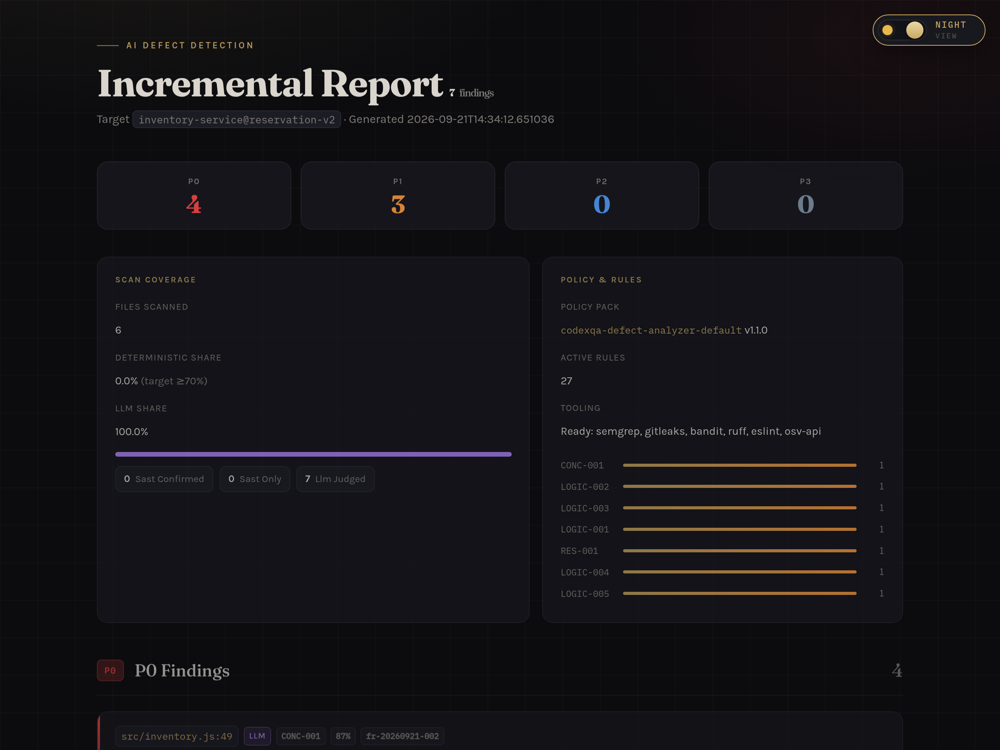
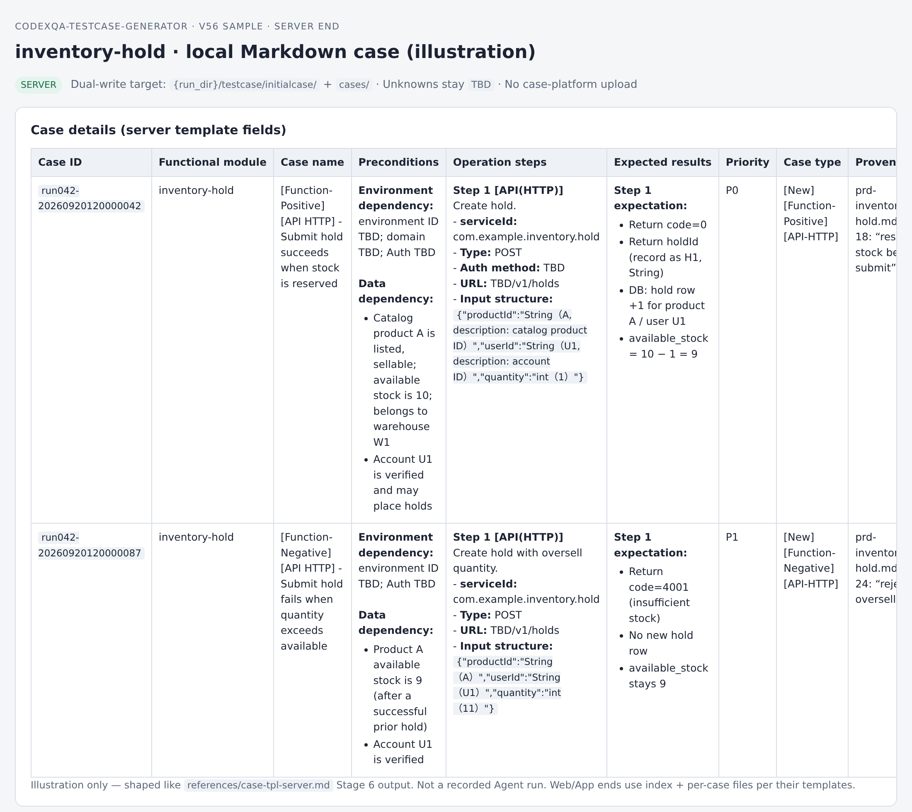
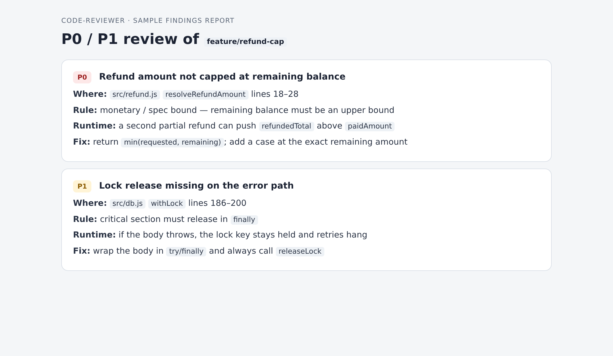
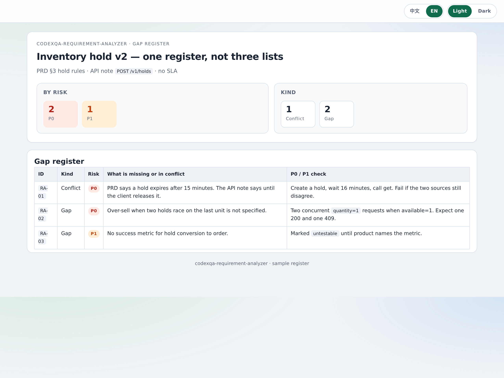
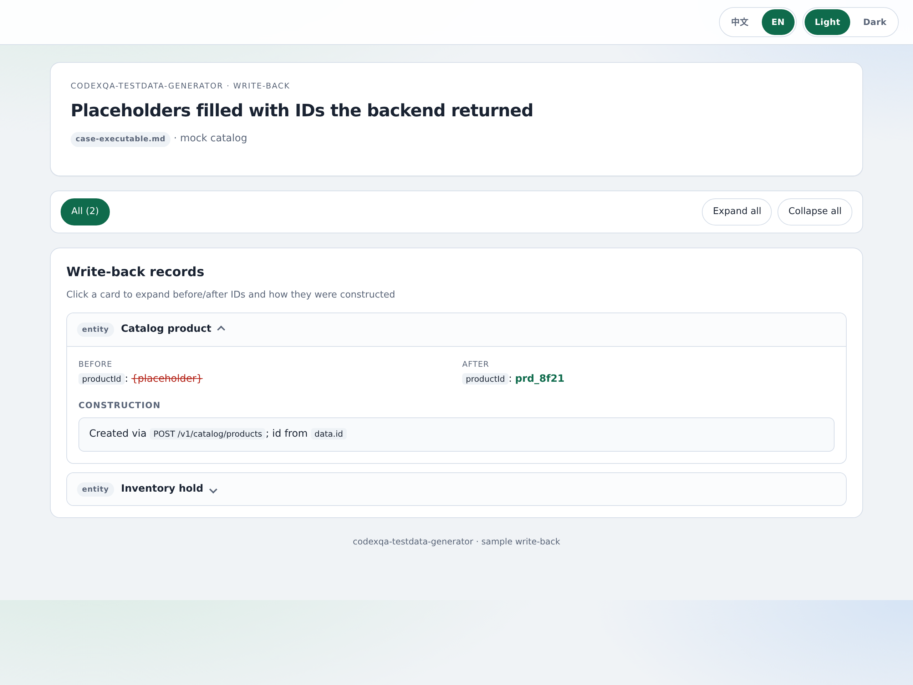

# OpenQA Skills

**为 AI 软件工程提供从需求到发布的质量验证基础设施。**

[](https://github.com/openqa-cn/openqa-skills/actions/workflows/repo-check.yml)
[](LICENSE)

[English](README.md)

<p align="center">
  <a href="#快速开始"><strong>快速开始</strong></a> ·
  <a href="#产物长什么样"><strong>产物长什么样</strong></a> ·
  <a href="docs/HOW_IT_WORKS.zh-CN.md"><strong>工作原理</strong></a> ·
  <a href="examples/inventory-service/README.md"><strong>盲测评估</strong></a> ·
  <a href="skills/defect-detection/KNOWN_LIMITATIONS.zh-CN.md"><strong>已知边界</strong></a> ·
  <a href="docs/GETTING_STARTED.zh-CN.md"><strong>安装入门</strong></a> ·
  <a href="docs/FAQ.zh-CN.md"><strong>FAQ</strong></a> ·
  <a href="docs/SUPPORT_MATRIX.zh-CN.md"><strong>支持矩阵</strong></a>
</p>

AI Coding 降低了实现成本，但一个补丁仍可能遗漏需求、削弱测试、破坏间接调用方，或通过未覆盖目标行为的检查。OpenQA 正在建设一层质量验证能力，把仓库上下文、需求、测试、分析结果、证据和人工发布决策连接起来。

> **Coding Agent 帮助生成变更，OpenQA 帮助判断这些变更是否值得信任。**

适合在以下场景使用本仓库：

- 按明确需求审查 Pull Request、分支、测试计划或交付任务
- 在人工评审前发现静态缺陷和业务逻辑缺陷候选
- 把分析结果整理为包含位置、触发条件、分析依据和修复建议的结构化发现
- 优先在本地运行，同时按需连接现有工程系统

## 本仓库提供什么

`openqa-skills` 是 OpenQA 面向 Coding Agent 的公开、本地优先 Skill 层。当前发布五个 skill，**输入各不相同**：

| Skill | 你要带上的 | 它做什么 |
| --- | --- | --- |
| [`defect-detection`](skills/defect-detection/README.zh-CN.md) | Git 地址 + 分支（再加需求或用例） | 克隆、分析变更方法、写出带门禁的发现 |
| [`code-reviewer`](skills/code-reviewer/README.zh-CN.md) | 本地 Git 工作副本 + 分支 / PR / commit | Playbook CR，产出 P0 / P1 / P2 报告；不克隆 |
| [`requirements-analyzer`](skills/requirements-analyzer/README.zh-CN.md) | PRD / 故事 / 接口说明（文档） | 一份缺口/冲突登记表，带 P0 / P1 验证 |
| [`testcase-generation`](skills/testcase-generation/README.zh-CN.md) | `prd/` 下的 PRD / 技术方案 / 契约 | 生成并更新手工用例库。`code/` 只在更新时用 |
| [`testdata-generation`](skills/testdata-generation/README.zh-CN.md) | 造数请求、用例，和/或 OpenAPI | 打后端（或本地 mock）拿真实 ID；不是 git 克隆 |

[`defect-detection`](skills/defect-detection/README.zh-CN.md) 工作流：

- 创建任务、克隆仓库、收集分支与 diff 上下文
- 基于 AST 规则分析变更方法，并可选使用 Java 调用图分析
- 本地 JSON provider，以及可选的 HTTP、GitHub、测试用例、文档、问题单和异常链路适配器
- 发现结果校验、写回、排序、标签和 HTML 报告
- 可确定复现的正常实现/预置缺陷案例，以及自动化 CLI 测试套件

各 skill 原理：[缺陷检测](skills/defect-detection/HOW_IT_WORKS.zh-CN.md)、[代码审查](skills/code-reviewer/HOW_IT_WORKS.zh-CN.md)、[需求分析](skills/requirements-analyzer/HOW_IT_WORKS.zh-CN.md)、[用例生成](skills/testcase-generation/HOW_IT_WORKS.zh-CN.md)、[数据构造](skills/testdata-generation/HOW_IT_WORKS.zh-CN.md)。索引：[docs/HOW_IT_WORKS.zh-CN.md](docs/HOW_IT_WORKS.zh-CN.md)。

## defect-detection 工作方式

静态规则能抓住「长什么样都认得」的问题：吞掉的异常、写死的密钥、没判空的引用。能混过评审的，往往是另一类：代码写得规范、测试也绿，但和需求不一致。

- 需求写「满 10 件打折」，代码用了 `>`，满 10 件反而没打上。
- 退款直接按申请金额走，没有按剩余可退余额封顶。
- 一个函数改了计数器，读同一份数据的缓存却从未失效。

这类 bug 不在语法树里，在**代码和意图对不上**的地方；意图在需求、用例里，不在 AST 里。模型能对照两者做判断，但放开了也会编造没读过的方法、对几百个方法写「没问题」、标出一堆没人看的噪音。

所以分工是：**模型做语义判断，基础设施保证这个判断能被核对。**

```text
仓库 + 分支 + 需求或用例
              │
              ▼
     收集上下文，分析这次改了什么
              │
              ▼
     AST 规则 + 可选调用图
              │
              ▼
     Agent 审查，发现项过校验
              │
              ▼
     结构化发现 + HTML 报告
              │
              ▼
           人工复核
```

OpenQA 编排流程；语义审查由你这边的 Agent / 模型做。本地就能跑，不必连私有后端；需要时再用适配器接到外部平台。

真正起作用的是三道约束：

1. **分层**：和需求、用例绑得越紧的方法，分析越深；其余不平均用力。
2. **23 条写回规则**：没读过代码、方法名在源码里找不到、整批结论像自动敷衍——一律拒收。
3. **关门闸**：任务结束前再查一遍覆盖率、报告是否对得上、证据够不够。

[inventory-service](examples/inventory-service/README.md) 盲测里，7 个业务逻辑缺陷藏在正常功能改动中，另有 4 个「看着像 bug、其实是对的」诱饵。一次已记录的 agent 跑出 7/7、0 误报，且这 7 处都不是 102 条 Semgrep 种子规则抓到的。这是单模型、单次、自建样例，不是榜单成绩。细节见[工作原理](skills/defect-detection/HOW_IT_WORKS.zh-CN.md)，做不到什么见[已知边界](skills/defect-detection/KNOWN_LIMITATIONS.zh-CN.md)。

### 产物长什么样

下面是**样例页**（和本地跑出来的是同一套渲染，发现项是写好的示例）。图旧了就直接打开 HTML。

<p align="center">
  <a href="docs/assets/previews/defect-report.html"></a>
</p>

<p align="center"><em>缺陷检测 HTML 报告：任务头、指标、三条和需求对不上的发现。<a href="docs/assets/previews/defect-report.html">打开页面</a>。</em></p>

<p align="center">
  <a href="docs/assets/previews/testcase-sample.html"></a>
</p>

<p align="center"><em>用例生成写出 Markdown。这是渲染后的样子：步骤、期望、空着的 Construction 列。<a href="docs/assets/previews/testcase-sample.html">打开页面</a>。</em></p>

<p align="center">
  <a href="docs/assets/previews/cr-findings.html"></a>
</p>

<p align="center"><em>代码审查报告：每条都有位置、规则、运行时影响和改法。<a href="docs/assets/previews/cr-findings.html">打开页面</a>。</em></p>

<p align="center">
  <a href="docs/assets/previews/ra-register.html"></a>
</p>

<p align="center"><em>需求分析：一份缺口 / 冲突登记表，每行带可执行检查。<a href="docs/assets/previews/ra-register.html">打开页面</a>。</em></p>

<p align="center">
  <a href="docs/assets/previews/testdata-writeback.html"></a>
</p>

<p align="center"><em>测试数据构造把 <code>{placeholder}</code> 换成后端真正返回的 ID。<a href="docs/assets/previews/testdata-writeback.html">打开页面</a>。</em></p>

## 能力地图

OpenQA 的产品方向覆盖 AI 软件工程全生命周期的质量验证。本仓库当前提供 [`defect-detection`](skills/defect-detection/README.zh-CN.md)、[`code-reviewer`](skills/code-reviewer/README.zh-CN.md)、[`requirements-analyzer`](skills/requirements-analyzer/README.zh-CN.md)、[`testcase-generation`](skills/testcase-generation/README.zh-CN.md) 和 [`testdata-generation`](skills/testdata-generation/README.zh-CN.md)。除非特别说明，下表中标记为**已提供**或**部分提供**的能力都由这些工作流提供；其余条目是规划方向，不代表已经包含在当前仓库中。

| 能力 | 当前仓库状态 | 范围 |
| --- | --- | --- |
| 缺陷检测 | **已提供** | 面向代码变更、测试计划和交付任务的 Agent 静态与业务逻辑审查 |
| 代码分析 | **部分提供** | 基于 AST 规则和变更方法分析；更多语言和框架仍在扩展 |
| 需求评审 | **已提供** | 对需求文档做缺口/冲突分析（`requirements-analyzer`）；实现是否符合需求仍是计划中 |
| 规格评审 | **计划中** | 检查技术规格的完整性、一致性和可测试性 |
| AI Code Review | **已提供** | Playbook 驱动的 PR / 分支 / commit 审查（`code-reviewer`）；尚无公开 fixture |
| 变更影响分析 | **部分提供** | 通过 GitNexus 提供 Java 调用图路径，并有降级行为；跨仓影响分析仍在规划 |
| 测试执行编排 | **计划中** | 在验证工作流中运行现有测试框架并采集结果 |
| 代码覆盖率分析 | **计划中** | 覆盖率质量信号和需求到测试的覆盖分析 |
| UI 端到端测试 | **计划中** | 浏览器和 UI 工作流生成、执行与结果集成 |
| 测试用例生成 | **已提供** | 根据 PRD、技术方案、接口契约和知识库生成并增量更新结构化手工用例 |
| 测试数据构造 | **已提供** | 通过 domain slot、工具、API 和生成脚本构造可复用测试数据，并回写到用例前置条件 |
| 问题定位与诊断 | **部分提供** | 发现结果包含位置、触发条件、分析依据和修复建议；更深入的根因诊断仍在建设 |
| 证据采集与结构化发现 | **已提供** | 发现校验、写回、排序、标签和可追踪 HTML 报告 |
| 本地 provider 与报告 | **已提供** | 本地优先的 JSON 持久化和报告生成，不依赖私有后端 |
| 企业与外部系统集成 | **部分提供** | HTTP 和 GitHub 适配器已有代码，需要部署配置 |
| 质量门禁与发布决策 | **产品方向** | 将验证结果连接到 CI 门禁和发布流程 |
| 托管验证服务 | **产品方向** | 不在本仓库中的 OpenQA 托管工程系统 |

> **状态说明：** **已提供**表示当前仓库可用；**部分提供**表示已有工作路径，但覆盖范围或集成仍不完整；**计划中**表示尚未在本仓库交付；**产品方向**表示 OpenQA 更大的平台目标。

> [!IMPORTANT]
> 当前缺陷检测工作流已经是一套可实际使用的工程工具，而不是只能用于实验的原型。它输出供人工确认的缺陷候选，不能替代测试、静态分析、安全审查或维护者判断。

- [OpenQA 官网](https://openqa.cn)
- [OpenQA 产品](https://openqa.cn/agent)
- [OpenQA Skill Hub](https://openqa.cn/skills)

## 安装

```bash
npx skills add openqa-cn/openqa-skills --skill defect-detection
npx skills add openqa-cn/openqa-skills --skill code-reviewer
npx skills add openqa-cn/openqa-skills --skill requirements-analyzer
npx skills add openqa-cn/openqa-skills --skill testcase-generation
npx skills add openqa-cn/openqa-skills --skill testdata-generation
```

按提示选择 Agent。全局安装到 Codex 时加 `--agent codex --global`。每个 `--skill` 只复制一个目录。

无需 OpenQA 或 npm 账号。运行要求、安装范围和故障排查见[安装与入门](docs/GETTING_STARTED.zh-CN.md)。

## 快速开始

1. 用上面的命令安装你需要的那个 skill。
2. 新建一个 Coding Agent 会话。
3. 把**该 skill 要的材料**交给 Agent。三者不能互相顶替。

### 审查分支（`defect-detection`）

```text
使用 defect-detection 审查 REPOSITORY_URL 的 BRANCH_NAME。
业务要求：结账金额必须大于零。
对每个疑似缺陷给出位置、触发条件、依据和修复建议。
```

将大写占位符换成真实内容。工作流会收集上下文、分析变更方法、校验发现并生成报告，供人工复核。

不需要模型或私有后端的契约示例（不是检测准确率）：

```bash
node examples/checkout-boundary/verify.mjs
```

### 审查本地工作副本（`code-reviewer`）

在 Agent 里打开该仓库。本 skill 原地 diff，不克隆。

```text
用 code-reviewer 对照 main 审查当前分支。
每条发现给出严重级别、文件:行号、规则、运行时影响和修复建议。
```

目前没有公开 fixture。要做带写回门禁的方法级需求缺陷审查，用 `defect-detection`。

### 分析需求（`requirements-analyzer`）

交文档，不要交仓库。

```text
用 requirements-analyzer 分析这些需求文档。
只出一份缺口/冲突登记表。P0 必须带验证字段。
源材料没有的接口和 SLA 不要编。
```

这是在审 PRD。要根据 `prd/` 写用例库，用 `testcase-generation`。

### 写用例库（`testcase-generation`）

先把 PRD / 技术方案 / 契约放到 `prd/`。生成阶段不需要 `code/`。

```text
用 testcase-generation 根据 prd/ 下的文档生成手工用例库。
源材料没写的工程字段不要编，写成 TBD。
```

Agent 停在 PRD 与技术方案冲突时，回复 `Confirm follow PRD` 或 `Item N follow technical design`。目前没有公开 fixture。

### 构造测试数据（`testdata-generation`）

不是 git 克隆。直接说要造什么，或指向已写好的用例 / OpenAPI：

```text
用 testdata-generation 建一个叫 Northwind Standard 的标准目录商品。
没配企业网关就走本地 mock。
```

回写用例前置：

```text
这份用例帮我准备测试数据，并把 ID 回写到前置条件。
```

默认后端是 `http://127.0.0.1:8765` 上的本地 mock。demo 拿到 ID **不等于** 写入了真实系统。

## 开发者验证

参与贡献前，请运行仓库检查：

```bash
python3 scripts/check-docs.py
export NODE_OPTIONS=--experimental-strip-types
(cd skills/defect-detection && npm test)
node examples/checkout-boundary/verify.mjs
```

这些检查覆盖文档链接、CLI 与 provider 行为、打包、任务隔离、写回校验和仓库自带的边界案例，但不能证明所有缺陷都会被发现。

## 适用边界

本项目用于组织代码上下文和验证证据，不能替代测试、静态分析、安全审查或维护者判断；也不能证明不存在缺陷，或推断未提供的业务规则。发现结果是待确认候选，不是自动合并决策。

本地 provider 会把数据写入磁盘。仓库克隆、文档获取、远程 provider、自动安装 Semgrep/GitNexus，以及宿主 Agent/模型都可能联网。处理私有源码前，请阅读 [FAQ](docs/FAQ.zh-CN.md)、[支持矩阵](docs/SUPPORT_MATRIX.zh-CN.md)和[安全说明](SECURITY.zh-CN.md)。

## 路线图

- **现在：** 加固干净环境安装、Agent 兼容性、公开案例和开发者文档。
- **下一步：** 按同一套“证据 + 人工复核”约定，增加规格评审、需求评审和更广泛的分析 Skill。
- **之后：** 接入跨仓影响分析、AI Code Review、CI 质量门禁和托管工程系统。

只有实现、案例和局限性都已公开的能力，才会在本仓库标记为“已提供”。进度见[公开路线图](https://openqa.cn/roadmap)。

## 文档导航

| 文档 | 内容 |
| --- | --- |
| [各 skill 的工作原理](docs/HOW_IT_WORKS.zh-CN.md) | 各 skill 原理索引 |
| [已知边界](skills/defect-detection/KNOWN_LIMITATIONS.zh-CN.md) | 具体失败场景、实现缺口，以及现有证据不足以支撑的结论 |
| [安装与入门](docs/GETTING_STARTED.zh-CN.md) | 运行要求、安装范围、本地设置和故障排查 |
| [FAQ](docs/FAQ.zh-CN.md) | 账号、数据处理、联网行为、报告和局限性 |
| [支持矩阵](docs/SUPPORT_MATRIX.zh-CN.md) | 已验证的运行时、Agent、集成和已知限制 |
| [架构说明](docs/ARCHITECTURE.md) | 仓库结构、命名和项目成熟度模型 |
| [示例](examples/README.zh-CN.md) | 可运行案例和预期结果 |
| [安全说明](SECURITY.zh-CN.md) | 安全问题反馈和数据处理指引 |

## 获取支持

- 通过 [GitHub Issues](https://github.com/openqa-cn/openqa-skills/issues) 报告可复现问题
- 在 [GitHub Discussions](https://github.com/openqa-cn/openqa-skills/discussions) 提问和讨论实现方案
- 安全漏洞请按照[安全说明](SECURITY.zh-CN.md)反馈

寻求帮助时，请提供 commit 或 Skill 版本、操作系统、Agent、命令、预期结果和实际结果。分享前请移除凭据、私有源码和专有日志。

## 参与贡献

欢迎提交误报或漏报的最小公开复现、正常对照、新分析规则、案例和文档改进。分享前请移除凭据、私有源码和专有日志。请从[贡献指南](CONTRIBUTING.zh-CN.md)、[示例](examples/README.zh-CN.md)和[发布流程](PUBLISHING.zh-CN.md)开始。

Apache-2.0 · [GitHub](https://github.com/openqa-cn/openqa-skills)
