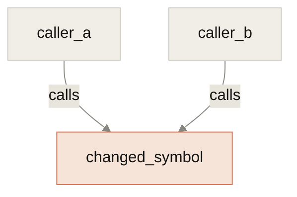

# Evidence call graphs (qualified)

## HTML report surface (required)

Put blast-radius / call paths on **findings** and **concern dimension cards** via
`call_chain` in `review-conclusion.json`. `render-review-html.sh` draws them as
**pure HTML/CSS** nodes + arrows (no Mermaid, no CDN, no external components).

Preferred shapes:

```json
"call_chain": {
  "title": "生产绘制主路径",
  "paths": [["border_draw", "knit_draw", "knit_get_tile", "knit_make_tile"]],
  "focus": ["knit_draw", "knit_make_tile"]
}
```

or a single path array: `"call_chain": ["A", "B", "C"]`.

Standalone top-level `diagrams[]` Mermaid blocks are **not** rendered into
`REVIEW-REPORT.html` anymore (legacy JSON may still keep them).

## Optional Mermaid (chat / notes only)

If you still sketch Mermaid in Markdown notes, keep the style below. Nodes and edges
must come from this run’s query artifacts. Inventing modules or calls fails the bar.

## Required Mermaid style (copy verbatim when used)

First line of every diagram:

```text
%%{init: {'theme':'base','themeVariables':{'background':'#FAF9F5','primaryColor':'#F0EEE6','primaryTextColor':'#141413','primaryBorderColor':'#D1CFC5','lineColor':'#87867F','secondaryColor':'#E8E6DC','tertiaryColor':'#FAF9F5','clusterBkg':'#F0EEE6','clusterBorder':'#D1CFC5','fontFamily':'Georgia,serif'}}}%%
```

End with:

```text
classDef add fill:#E4EDD8,stroke:#788C5D,color:#141413
classDef change fill:#F6E4D8,stroke:#D97757,color:#141413
classDef risk fill:#F3DDD8,stroke:#C6613F,color:#141413
```

Then `class <nodes> add|change|risk` as appropriate.

| class | When |
|---|---|
| `add` | `change_status=add` |
| `change` | `change_status=change` |
| `risk` | sensitive, high fan-in, untested, entry-reachable |

## Which diagram

| Mode / question | Diagram | Type |
|---|---|---|
| PR change groups | Group topology from `change-groups` | `flowchart LR` + subgraph |
| PR Design fit | Layer belonging from `10-design-fit-signals` + edges-in | `flowchart TB` + subgraph 入口/应用/领域/存储 |
| Blast radius | Changed ← callers | `flowchart TB` |
| Entry risk | Entry → service → changed | `flowchart LR` |
| Full-repo architecture | Layers: 入口 / 应用 / 领域 / 存储 only | `flowchart TB` + subgraph |
| Test gaps | Production vs tests edge present/absent | `flowchart LR` |

Rules:

- 8–15 real nodes; truncate with `truncated` note
- Edge labels `calls` / `tests` / `imports` must match pack
- Architecture subgraph titles **only**: 入口 / 应用 / 领域 / 存储
- Design-fit diagrams: nodes from `labeled_files` / `cross_layer_edges` / edges-in only — never invent modules
- Below each diagram: evidence commands, truncation note, one graph-backed conclusion

## Minimal PR blast-radius skeleton

Replace labels with names from `impact/*/reach-in.json` / `edges-in.json`:


