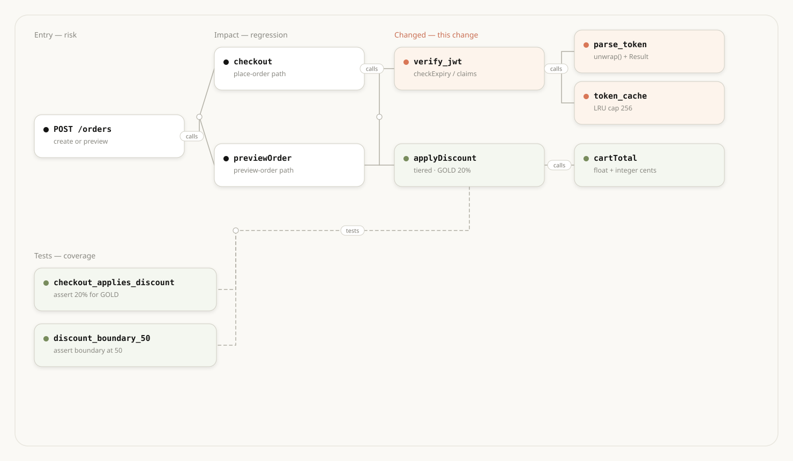

[English](README.md) · **简体中文** · [已知边界](KNOWN_LIMITATIONS.zh-CN.md)

# CodexQA Skill

**在对话里，把代码仓库变成可查询的符号图，用来审变更、圈回归、找测试缺口、追报错。**

CodexQA 先把仓库解析成仓库代码关系符号图，再按固定路径回答「改了什么、会影响谁、测没测到、报错从哪来」。Cursor / Claude Code 读 [`SKILL.md`](SKILL.md)。

- **审变更** —— 对照基线把改动按组摊开，先看高风险组和方法级补丁
- **圈回归** —— 从被改符号追调用方，标出会打到的 HTTP / RPC / MQ / 定时任务
- **找测试缺口** —— 看生产符号有没有图上的 `tests` 边罩住，不是「仓库里有测试目录」
- **追报错** —— 用日志、堆栈、错误文案落到符号，再看谁调用、测没测到

`code-analyzer` 用图证据回答的是**结构和影响面**问题；它不判断实现是否符合业务需求，也不产出 P0 / P1 / P2 审查结论。架构知识图谱（模块地图和阅读导览）用 `code-wiki`，需求类缺陷发现和门禁写回用 `defect-detection`，playbook 驱动的具体实现问题用 `code-reviewer`。可以串联：先在这里圈影响面，再把深审聚焦到高风险路径。

索引支持 **TypeScript、JavaScript、Vue、Java、C/C++、C#、Python、Go、PHP、Rust**。`stats` / `summary` 里能看到本仓库的语言分布。

Skill、playbook、schema 和示例发布在本仓库中；依赖的 `@openqa-cn/codexqa` 是单独分发的闭源本地代码分析引擎。建索引和图查询在用户机器上完成，不需要 LLM；索引和会话写在 `~/.codexqa/`。验证状态和图完整性边界见[已知边界](KNOWN_LIMITATIONS.zh-CN.md)。

```bash
npm install -g @openqa-cn/codexqa --registry https://registry.npmjs.org/
```

不需要先接模型：装好 CLI，给仓库建索引，就能在对话里开始审。

---


## 快速开始


### 1. 安装

先装 skill，再装 CLI。需要 **Node.js >= 18**。

```bash
npx skills add openqa-cn/codexqa --skill code-analyzer
npm install -g @openqa-cn/codexqa --registry https://registry.npmjs.org/
codexqa --help
```

命令找不到时，把 `$(npm prefix -g)/bin` 加进 PATH。已安装则不要重装。

**Cursor / Claude Code：** 把 [`SKILL.md`](SKILL.md) 放到对应 skills 目录。提到建索引、查调用、影响面、变更审查、测试覆盖时，按 SKILL 走 CLI。

### 2. 先建索引——结论从仓库读出来，不靠 Prompt 猜

```bash
codexqa index /path/to/repo
codexqa stats /path/to/repo
```

审相对基线的变更时必须加 `--diff-base`，否则每个 `change_status` 都是 `default`，没有可审对象：

```bash
codexqa index /path/to/repo --diff-base origin/main
```

也可以直接在对话里说：

```text
分析这个仓库，然后用 CodexQA 审相对 origin/main 的变更。
先看高风险变更组，再圈回归范围和测试缺口，标出可达的 HTTP / RPC / MQ 入口。
```

只想定位一条报错时：

```text
这条报错 TokenExpired 从哪来？落到符号，再看谁调用、有没有测试罩住。
```


### 3. 在对话里细调

继续说：`只看支付相关组`、`把回归扩到入口`、`把未覆盖的高 fan-in 符号列出来`。Agent 应保留已建索引，只补查相关符号和边，不要整仓重写结论。

---


## 选择合适的场景


| 场景              | 最适合                             | 对话里应包含             |
| --------------- | ------------------------------- | ------------------ |
| **PR / 分支变更审查** | 审 PR、对照 `origin/main`、问这次改了什么   | 基线 ref、关注模块        |
| **回归范围**        | 改了公共函数 / 底层工具，圈谁会被打到            | 符号名、要追几层           |
| **测试缺口**        | 生产符号有没有 `tests` 边罩住             | 变更范围，不要只问「有没有测试目录」 |
| **线上报错 / 缺陷定位** | 日志、堆栈、错误文案对不上函数名                | 报错原文、异常类、注释短语      |
| **入口风险**        | HTTP / RPC / MQ / 定时任务会不会走到这次改动 | 入口类型、变更符号          |
| **敏感路径**        | 鉴权、支付、凭证、权限                     | 关键词、是否已变更          |
| **模块职责 / 架构漂移** | 新人接手、跨层变更、怀疑放错层                 | 模块或文件                   |
| **索引自检**        | 结果空、变更全是 `default`、准备写报告        | 仓库路径或 `repo_id`    |


不知道走哪条？先说要审的基线和问题，再按上表选一节。下面场景都假设已经 `codexqa index`。涉及「相对基线的变更」时，必须再加 `--diff-base`。

---


## 为什么用 CodexQA Skill

- **用符号图判断代替通读整个 diff** —— 先按调用 / 同文件把变更分组，高 fan-in 优先，再对前几组读方法级补丁
- **覆盖看图上的** `tests` **边** —— `tested_count` 和 `reach --direction in --edge-kinds tests` 才算罩住；测试目录名、`search --tests-only` 命中都不能写成「已覆盖」
- **入口从变更往回走** —— 用 tag 找 HTTP / RPC / MQ / 任务角色，再用 `reach` / `path` 验证是否打到这次改动，不按函数名猜入口
- **交互不编造拓扑** —— 报告里的节点和边必须能对上本次 query；一张图 8–15 个节点，写不下就截断并标明
- **失败也有固定卡点** —— 索引不在、不是 diff 索引、全文检索没建、stub / 碰撞偏多，都有对应处理，不要空转或降级成主观推断

CodexQA Skill 不是通用 Code Review 套话，也不是绘图编辑器。它负责把仓库事实收成可审的证据，再交一份带图的保障报告。

---


## 工作原理

CodexQA 先把仓库解析成**仓库代码关系符号图**，再在对话里对图提问。节点是函数、方法、文件；边是调用、测试、依赖。结论从这张图读出来，不靠模型通读 diff，也不靠 Prompt 猜拓扑。

```text
仓库源码
   │  index（可选 --diff-base）
   ▼
仓库代码关系符号图：符号 + 调用 / 测试 / 依赖 + 变更标签
   │  query
   ▼
变更组 · 方法级补丁 · 调用方 · 测试边 · 入口
   │  按场景判定
   ▼
带 Mermaid 图的证据报告
```

你实际只会碰到四步：

1. **建索引** —— `codexqa index` 解析仓库，写入本机。审相对基线的变更时必须加 `--diff-base`：整棵树都会解析，只是给变过的文件 / 符号打上 `add` / `change` / `delete`。不加的话每个节点都是 `default`，没有可审对象。
2. **查图** —— `codexqa query` 按符号、边、变更组取数。每个节点带几个判定字段：有没有变（`change_status`）、有几条测试边罩住（`tested_count`）、有多少人在调用它（`to_count`，入度）。`from_count` 是出度（它调用了谁），不能当成爆炸半径。
3. **按场景判定** —— 读方法级补丁、向上追调用方、核验 `tests` 边、标可达的 HTTP / RPC / MQ / 定时任务入口。只深挖当前问题指向的那一块；索引已经在，不必整仓重跑、也不必整图重写结论。
4. **交报告** —— Agent 在 Cursor / Markdown 里给出带 **Mermaid** 图的证据：必看组、改了什么、必测入口、测试缺口。图上的节点和边必须能对上本次查询。

保障一次变更的主路径：

```text
index --diff-base <ref>  →  change-groups  →  symbol-diff  →  调用方 / 测试 / 入口
```

索引和查询都在本地完成，不需要模型。对话审查才用到 Agent，而且必须能对上本次 `query` 结果。后面各场景都是这条主路径上的不同切面，不是另一套工具。

---


## 质量保障能回答什么


| QA 问题           | 怎么答                                                                  |
| --------------- | -------------------------------------------------------------------- |
| 这次 PR 该先看哪几块？   | 按调用 / 同文件把变更分组，高 fan-in 优先                                           |
| 改了什么、和基线差在哪？    | 方法级 unified diff；文件级对照基线源码                                           |
| 回归范围有多大？        | 向上追调用方，必要时扩到入口（HTTP / RPC / MQ）                                      |
| 哪些生产代码没测试罩住？    | 变更符号的 `tested_count`，再用 `reach --direction in --edge-kinds tests` 核验 |
| 这条报错 / 堆栈从哪来？   | 全文搜字面量，落到符号再看调用链                                                     |
| 鉴权、支付这类敏感路径动了吗？ | 名称 / 字符串检索 + 变更状态 + 入度                                               |
| 两个模块之间会互相打到吗？   | 最短路径、import 方向                                                       |
| 这套分析可信吗？        | 看索引规模、stub、碰撞，再决定深挖                                                  |


---


## 应用场景


### 1. PR / 分支变更审查

**何时：** 审 PR、对比 `origin/main`、问「这次改动影响了什么」。

```bash
codexqa index /path/to/repo --diff-base origin/main
# 远程功能分支对照 main
# codexqa index https://github.com/org/repo.git -b feature --diff-base main

codexqa query --repo <repo> change-groups
codexqa query --repo <repo> files --change add,change
codexqa query --repo <repo> symbols --change add,change --kind function,method
codexqa query --repo <repo> symbol-diff --id <id>
```

**怎么判：**

1. `change-groups` 按最大 fan-in 排序——风险最高的组先看。`groups` 为空则不是 diff 索引，重跑 `--diff-base`。`truncated: true` 时图谱不完整，报告里写明。
2. 前 5–8 组用 `symbol-diff` 读补丁。**diff 文本是「改了什么」的唯一来源**，不要靠猜。超长则加 `--max-lines`（硬上限 500）或改 `snippet`。
3. 文件级回退：`file-source` 对 `file-base`。后者为空 = 不是 diff 索引或该文件没变。
4. 每组再走场景 2（影响面）和场景 3（测试缺口）。名称含 `auth` / `token` / `pay` / `password`，或 `to_count` 很高（fan-in），提高风险。

`--diff-base` 仍解析整棵树，只是打变更标签；和增量 `index`（只重解析脏文件）不是一回事。

---


### 2. 回归范围与爆炸半径

**何时：** 改了公共函数 / 底层工具，要圈「谁会被打到、测到哪一层」。

```bash
codexqa query --repo <repo> symbols --name <符号名>
codexqa query --repo <repo> edges --id <id> --direction in
codexqa query --repo <repo> reach --id <id> --direction in
codexqa query --repo <repo> reach --id <id> --direction in --depth 2 --edge-kinds calls,tests
codexqa query --repo <repo> path --from <调用方id> --to <被改符号id>
```

**怎么判：**

- `edges --direction in`：直接调用方，回归用例的第一圈。
- `reach --direction in`：传递调用方。`--depth` 从 2–3 起，最大 10；没有路径就直说。
- `--edge-kinds calls,tests`：同时看到有没有测试边够到它。
- `path`：验证「入口 A 会不会打到这次改动」。`hops=-1` = 在深度内不相通。
- 文件级：`imports --direction in` 看谁依赖这个文件。

产出应是**可测的调用方清单**（文件 + 符号），不是一句「影响面很大」。

---


### 3. 测试缺口

**何时：** 变更审查或「这个模块有没有单测」。问的是**生产符号有没有** `tests` **边罩住**，不是仓库里有没有测试目录。

查询默认排除测试文件 / 符号，所以下面第一条拿到的是生产变更。

```bash
# 1. 变更生产符号；每条 JSON 看 tested_count
codexqa query --repo <repo> symbols --change add,change --kind function,method

# 2. 对要核验的符号，只沿 tests 边看谁罩住它（edges 没有 --edge-kinds）
codexqa query --repo <repo> reach --id <id> --direction in --edge-kinds tests

# 3. 可选：测试文件里是否出现过这个符号名（有词 ≠ 有 tests 边）
#    符号名核验必须先按标识符建全文索引。默认 simple 会拆 snake_case
#    （into_value → into+value），--tests-only 会假阳性。
codexqa search-index <repo> --force --tokenizer whitespace
codexqa query --repo <repo> search --query "<符号名>" --tests-only
```

**怎么判：**

- `tested_count` = 指向该生产符号的 `tests` 边数，不是生产入度 `to_count`（`from_count` 是出度，更不是入度）。
- **已变更的生产符号 +** `tested_count == 0` **+** `reach --direction in --edge-kinds tests` **为空** → 记为缺口。
- `search --tests-only` 只能说明测试文件里出现过该**整词**。默认 simple（snake_case-friendly）会把 `into_value` 拆成 `into`+`value`，命中 ≠ 源码里有这个符号。要用 search 核验符号名，必须先 `search-index --force --tokenizer whitespace`。换分词器必须 `--force`。不能单独写成「已覆盖」。
- `symbols --include-tests` / `files --include-tests` 只是把测试符号 / 文件加进列表，不能用来判覆盖。
- `imports` 里 `edge_source=tests` 是文件级覆盖，补「有测试文件但没链到符号」。
- 缺口按风险排序：敏感名称、高 fan-in、可达 HTTP / RPC / MQ 入口的优先补。

---


### 4. 线上报错 / 缺陷定位

**何时：** 日志、堆栈、错误文案、注释短语、用户描述对不上函数名。
全文检索覆盖源码、注释、字符串、报错文案；搜注释与搜报错同一条 `search`。

```bash
codexqa search-index <repo>                 # 默认 simple：报错 / 注释 / 短语
# 核验 snake_case / 符号名时必须先换分词器（已建过也要 --force）：
# codexqa search-index <repo> --force --tokenizer whitespace
codexqa query --repo <repo> search --query "TokenExpired"
codexqa query --repo <repo> search --query "Per-read inactivity time"
codexqa query --repo <repo> symbols --name verify_jwt
codexqa query --repo <repo> source --id <id>
codexqa query --repo <repo> edges --id <id> --direction in
codexqa query --repo <repo> snippet --file <path> --start <n> --end <n>
```

**怎么判：**

1. 先用报错原文 / 异常类名 / 注释短语搜（全文），落到文件和行。
2. 再 `symbols` 对齐符号，`source` / `inspect` 看实现。
3. `edges --direction in` 回答「谁触发了这条路径」，便于复现和回归用例。
4. 全文索引没建时先 `symbols` / `files`，不要空转 `search`。

不知道函数名、只知道「重试逻辑在哪」时，再走场景 7，用 `summary` / `imports` / `search` 落到文件，再用 `snippet` 对源码。

---


### 5. 接口、消息、任务入口风险

**何时：** 变更可能打到对外 HTTP / RPC、MQ 消费、定时任务，要回答「线上哪条入口会走到这次改动」。

```bash
codexqa tag <repo> keys --json
codexqa query --repo <repo> tagged --key framework.http
codexqa query --repo <repo> tagged --key framework.http.client
codexqa query --repo <repo> tagged --key <key>
# 逆向走到底（当前上限 10 跳）
codexqa query --repo <repo> reach --id <变更符号id> --direction in --depth 10
# 看 hops 最后一层的节点：to_count 是否为 0（入度；from_count 是出度，不能当入口）
#   - 全是 0 → 已到入口（main / handler / test entry）
#   - 还有 > 0 → 拿这些节点 id 再跑一轮 graph-reach，直到最后一层 to_count 全为 0
```

**怎么判：**

- Tag 找**角色**（端点、消费者、出站客户端），不要按函数名找。
- `framework.http` 是服务端路由；REST 客户端查 `framework.http.client`。只查前者会空。
- `tag keys` 没有本仓语言的 key，或 `tagged` 为空：从代码补（`search` `/api/`、`symbols` Client 方法），不要停、不要编入口。
- 入口能 `path` 到变更符号 → 标为必测入口（接口用例 / 消费用例 / 任务用例）。
- 只改过本地 tag 规则才跑 `codexqa tag <repo> run`。

---


### 6. 敏感路径（鉴权 / 支付 / 凭证）

**何时：** 变更或排查涉及登录、token、支付、密码、权限。

```bash
codexqa query --repo <repo> symbols --name token --kind function,method
codexqa query --repo <repo> symbols --change add,change
codexqa query --repo <repo> search --query "password OR secret OR api_key"
codexqa query --repo <repo> edges --id <id> --direction in
```

**怎么判：**

- 命中且 `change_status` 为 `add`/`change`，或 `to_count` 高：默认高风险。
- 必须走场景 2 + 3：调用方清单和测试缺口都要写。
- 有 tag 的鉴权 / 支付入口，按场景 5 标必测入口。
- 结论写清「改了哪段、谁调用、有没有测试」，不要只标「敏感」了事。

---


### 7. 模块职责与架构漂移

**何时：** 新人接手、跨模块变更、怀疑放错层。

```bash
codexqa stats <repo>
codexqa query --repo <repo> summary
codexqa query --repo <repo> imports --file crates/core/src/main.rs --direction out
codexqa query --repo <repo> search --query "重试逻辑"
```

**怎么判：**

- `stats` / `summary`：语言、文件、符号规模，先建立「仓库长什么样」。
- `imports`：文件依赖是否越层（例如 UI 直接打到 DB）。
- **源码才是权威**。命中后用文件和行号对照 `snippet`。

---


### 8. 索引可信度（分析前自检）

**何时：** 查询结果空、变更全是 `default`、或准备拿图结论写报告。

```bash
codexqa repos --filter <子串> --limit 200
codexqa repos --limit 200
codexqa stats <repo>
codexqa query --repo <repo> summary
```

**怎么判：**


| 现象                                      | 处理                                                                                               |
| --------------------------------------- | ------------------------------------------------------------------------------------------------ |
| `repo index not found` / `repos` 里没有这个仓 | 先 `index`；核对用 `repos --filter <子串> --limit 200`，看 showing / `has_more`。不要裸跑 `repos`（默认 20 条静默截断） |
| 多个分支且没写 `@branch`                       | 列出分支让人选，不要擅自默认                                                                                   |
| 每个 `change_status` 都是 `default`         | 不是 diff 索引，重跑 `index --diff-base <ref>`                                                          |
| `file-base` 为空                          | 同上，或该文件相对基线没变                                                                                    |
| `search` 无结果                            | 先 `search-index`；期间用 `symbols`                                                                   |
| `search --tests-only` 命中但 grep 没有该符号    | 默认 simple 会拆 snake_case；符号名核验须先 `search-index --force --tokenizer whitespace`                    |
| `stats` 里 stub / 碰撞偏多                   | 图边可能不全，影响面结论要降置信                                                                                 |
| 大仓库首次索引很慢                               | 等全量跑完再审，不要拿半截索引下结论                                                                               |


`<repo>`：本地路径（建索引首选；有 checkout 时优先，不要先扫列表）、`github.com/org/repo@main`（从 `repos --limit 200` 复制，须看 `has_more`）、远程 git URL（**仅 index**）。

---


## 命令怎么对应到 QA

只列和保障相关的能力；维护类（`status` / `restart` / `delete`）见 SKILL。


| 命令                                                   | QA 用法                                                                                                                         |
| ---------------------------------------------------- | ----------------------------------------------------------------------------------------------------------------------------- |
| `index [--diff-base]`                                | 建图；diff 模式给文件 / 符号打 `add` / `change` / `delete`                                                                               |
| `repos` / `stats` / `query summary`                  | 确认索引在、规模和语言分布。`repos` 默认 `--limit 20`、上限 200，超出一页静默截断，须看 `has_more` / `--offset`                                              |
| `query symbols` / `inspect` / `source`               | 定位符号，读实现，看 `to_count`（入度）、`tested_count`、`change_status`                                                                      |
| `query edges` / `reach` / `path`                     | 调用方、传递影响、两点是否连通                                                                                                               |
| `query change-groups` / `symbol-diff`                | 变更拓扑 + 方法级补丁（审查主路径）                                                                                                           |
| `query files --change` / `file-source` / `file-base` | 变更文件清单；文件级新旧对照                                                                                                                |
| `query search`（先 `search-index`）                     | 报错文案、注释、字符串。符号名核验须 `search-index --force --tokenizer whitespace`，否则默认 simple 会拆 snake_case 导致假阳性；`--tests-only` 只说明测试文件里出现过该词 |
| `tag keys` / `query tagged`                          | HTTP / RPC / MQ / 定时任务等入口                                                                                                     |
| `query imports` / `file` / `snippet`                 | 文件依赖、目录、定点读源码                                                                                                                 |


---


## 建议工作流

```text
# 理解现有行为 / 定位缺陷
index → stats → search 或 symbols → source → edges/reach

# 保障一次变更
index --diff-base <ref>
  → change-groups（先看高风险组）
  → symbol-diff（只信补丁）
  → edges/reach + tagged（回归范围、入口）
  → tested_count / search --tests-only（缺口）
  → 报告：必看组、必测入口、缺口、敏感路径 + 架构/拓扑图

# 可选
search-index   # 报错/注释/文案检索；符号名核验须 --force --tokenizer whitespace
```

---


## 报告里的图


文字报告要配图，不要只贴 JSON。Agent 在 Cursor / Markdown 里用 **Mermaid**。


| 场景      | 画什么                    |
| ------- | ---------------------- |
| 变更审查    | 变更组拓扑（`change-groups`） |
| 回归范围    | 爆炸半径（被改符号 ← 调用方）       |
| 入口风险    | 入口 → 服务 → 被改符号         |
| 架构 / 接手 | 入口 / 应用 / 领域 / 存储分层图   |
| 测试缺口    | 生产符号与 `tests` 边        |


约定：节点和边只来自查询结果；一张图 8–15 个节点；边标注 `calls` / `tests` / `imports`；`add` 绿、`change` 橙、敏感 / 未覆盖红。图下写证据命令和结论。模板见 [`references/diagrams.md`](references/diagrams.md)。

示例：入口 `POST /orders` 打到本次改价 `applyDiscount`，`verify_jwt` 为变更，测试边罩住折扣逻辑。



---


## 安装与接入


| 使用位置             | 安装位置或方法                                                                                     | 能力                  |
| ---------------- | ------------------------------------------------------------------------------------------- | ------------------- |
| **CLI**          | `npm install -g @openqa-cn/codexqa`                                                         | 建索引、查询 |
| **Cursor**       | 把 `code-analyzer/` 放到 `~/.cursor/skills/` 或 `.cursor/skills/`                               | 完整 QA 工作流           |
| **Claude Code**  | `~/.claude/skills/` 或 `.claude/skills/`                                                     | 完整 QA 工作流           |
| **本机插件**         | 没有 `~/.codexqa/plugins/codexqa/` 时，`codexqa-agent` 会落盘这份内置插件                                | MCP 工具声明     |


维护类命令（`status` / `restart` / `delete`）见 [`references/cli.md`](references/cli.md)。

---


## 参考与边界

- [路由与报告合同](SKILL.md)
- [分析方法论](references/playbook.md)
- [报告图规范与模板](references/diagrams.md)
- [安装 / 仓库标识 / LLM / 维护](references/cli.md)
- [图查询工具 Schema](references/mcp.json)

本 Skill 不提供 `codexqa diff` / `codexqa review`，也不自动生成交互式 HTML / Archify 画布。没有索引时不要 query 或审 diff。全文检索用户没要求就不要跑。

---


## 包内容

```text
code-analyzer/
├── README.md                 # English（场景选路 + QA 手册）
├── README.zh-CN.md           # 本文件
├── SKILL.md                  # Agent 路由 + 报告合同
├── assets/                   # 报告图示例
└── references/
    ├── playbook.md           # 场景步骤（按需加载）
    ├── diagrams.md           # 报告图规范与模板
    ├── cli.md                # 安装 / 仓库 / LLM / 维护
    └── mcp.json              # 图查询工具声明
```
