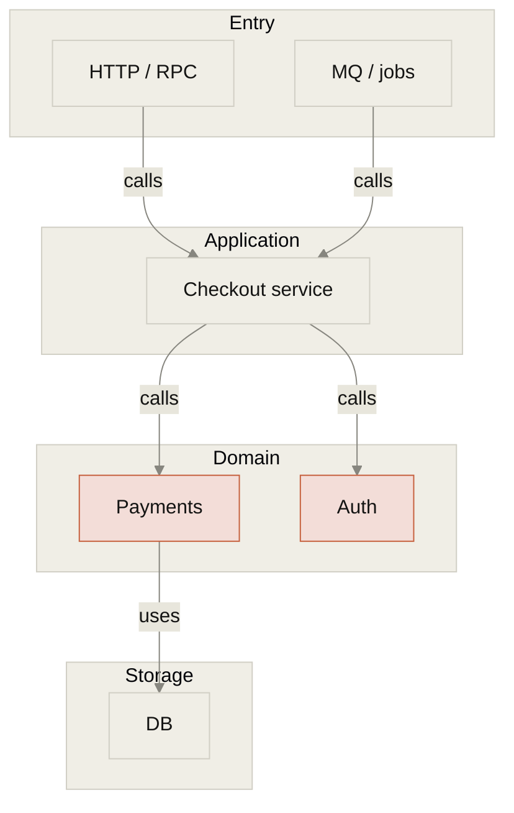
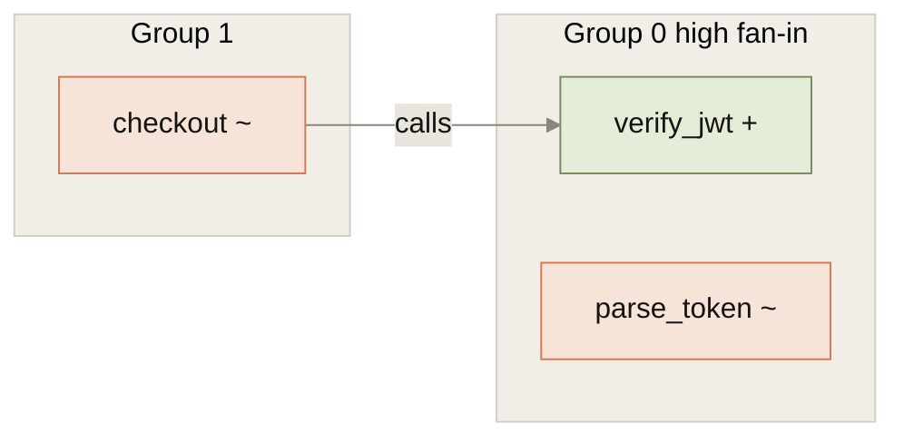
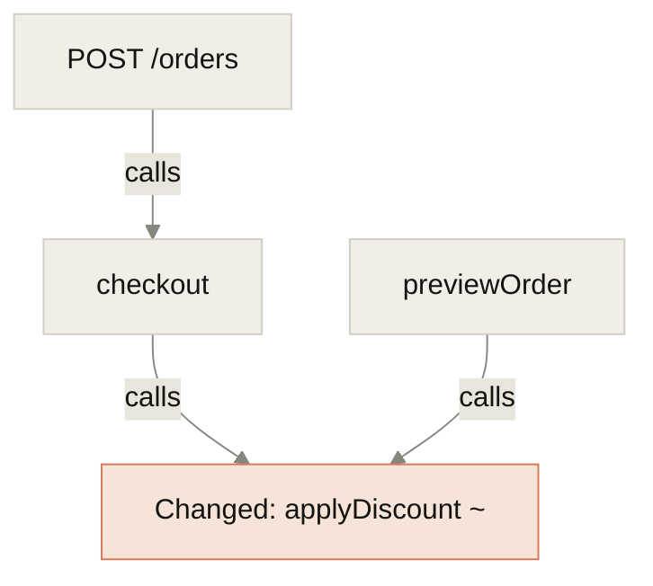

# Diagrams in the report

Read this file before drawing. Nodes, edges, and groups must come from this `query`. **Do not invent** modules or calls that were not returned.
Prefer **Mermaid** (Cursor / GitHub / most Markdown renderers).

An interactive architecture canvas (grouped swimlanes, curved edges) is **not the default**. Deliver Mermaid only. Do not pretend a GUI is open.

## Diagram quality bar (redraw if any item is missing)

1. The first line must copy the `%%{init:...}%%` below verbatim (Claude paper look: ivory ground, slate text, warm-gray borders).
2. The end must copy the three `classDef` lines verbatim, then write `class`.
3. Architecture / risk diagrams need at least one core module `class ... risk` (sensitive name, high fan-in, uncovered, or reachable entry).
4. Change diagrams mark `add` (olive) / `change` (clay orange) from `change_status`; unchanged nodes keep the default ivory fill.
5. Architecture `subgraph` titles may only be **Entry / Application / Domain / Storage**. Put the real symbols or files inside those layers.
6. 8–15 real nodes. If there are more, keep the top N by risk and write `truncated`.
7. Label edges `calls` / `tests` / `imports`, and every edge must match this query.
8. Three lines under the diagram: evidence commands, truncation note, conclusion on the diagram. Do not drop an empty picture.

Do not use: `theme:neutral` / Material green-orange-red, plain white or cold-gray ground, navy ground, a custom palette, package names as layers, or “there are nodes” without `classDef`.

Copy this as the first line of every diagram:

```text
%%{init: {'theme':'base','themeVariables':{'background':'#FAF9F5','primaryColor':'#F0EEE6','primaryTextColor':'#141413','primaryBorderColor':'#D1CFC5','lineColor':'#87867F','secondaryColor':'#E8E6DC','tertiaryColor':'#FAF9F5','clusterBkg':'#F0EEE6','clusterBorder':'#D1CFC5','fontFamily':'Georgia,serif'}}}%%
```

## Which diagram for which scenario

| Scenario | Draw | Mermaid type |
|---|---|---|
| Review one change | Change-group topology (symbols in a group + calls between groups) | `flowchart LR` + `subgraph` |
| Regression scope | Blast radius: changed symbol ← direct / transitive callers | `flowchart TB` |
| Entry risk | Entry → service → changed symbol | `flowchart LR` |
| Locate a defect | Trigger path: caller → failing symbol | `flowchart LR` |
| Architecture drift / understand the repo | Layered architecture: Entry / Application / Domain / Storage | `flowchart TB` + `subgraph` |
| Test gaps | Production symbols vs `tests` edges (present / missing) | `flowchart LR` |

Semantic color is only these three overlays (ivory paper + Claude accent colors, light fill / dark text):

| class | When | Color |
|---|---|---|
| `add` | `change_status=add` | olive `#E4EDD8` / `#788C5D` |
| `change` | `change_status=change` | clay orange `#F6E4D8` / `#D97757` |
| `risk` | high risk / sensitive / uncovered (`tested_count==0`) | terracotta `#F3DDD8` / `#C6613F` |

Every other node uses the default ivory fill `#F0EEE6`. Do not add Material green / bright orange / pure red. Copy this at the end of every diagram:

```text
classDef add fill:#E4EDD8,stroke:#788C5D,color:#141413
classDef change fill:#F6E4D8,stroke:#D97757,color:#141413
classDef risk fill:#F3DDD8,stroke:#C6613F,color:#141413
```

## Templates (replace nodes/edges with real query results; do not change init or classDef)

**Layered architecture** (`summary` + `imports` + `tagged`):



**Change-group topology** (`groups` + `inter_group_edges` from `change-groups`):



**Blast radius** (`edges` / `reach --direction in`):



Three lines under the diagram: evidence commands, truncation note, and a conclusion that points at edges on the diagram (for example “checkout and the preview order both hit this price change”). Do not drop an empty picture.
