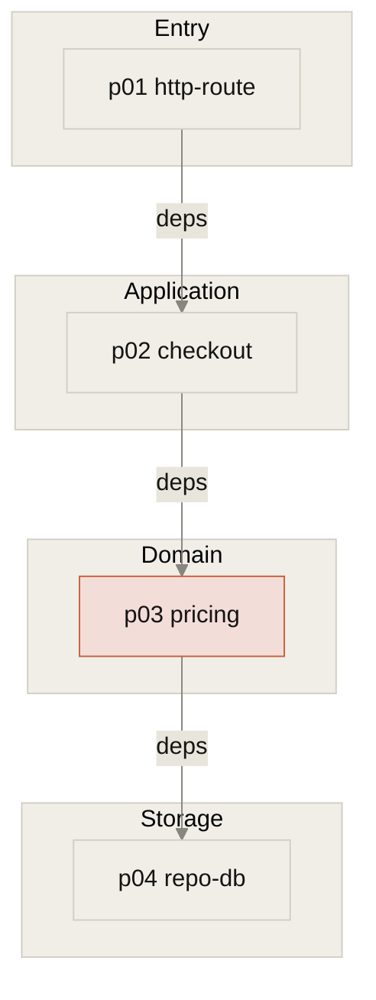
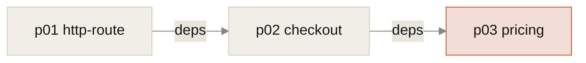
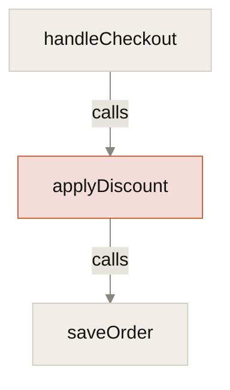

# Diagrams in the report

Read this file before drawing. Nodes, edges, and groups must come from this `wiki inputs` run. **Do not invent** modules or calls that were not returned.
Place each diagram in a `.diagram` slot of the HTML report ([report.md](report.md)). Chat-only Mermaid is not the deliverable.

An Archify / grouped-swimlane architecture canvas is **not** the deliverable.

## Diagram quality bar (redraw if any item is missing)

1. The first line must copy the `%%{init:...}%%` below verbatim (Claude paper look: ivory ground, slate text, warm-gray borders).
2. The end must copy the three `classDef` lines verbatim, then write `class`.
3. Architecture / risk diagrams need at least one core module `class ... risk` (high `node_count`, high `called_by`, or a hub in `deps`).
4. Isolated modules (empty `deps`) stay outside functional layers — put them in a peripheral cluster or omit them from the layer diagram and say so.
5. Architecture `subgraph` titles may only be **Entry / Application / Domain / Storage**. Put real community aliases (`p01` + rule title) inside those layers.
6. 8–15 real nodes. If there are more, keep the top N by `node_count` / dep weight and write `truncated`.
7. Label edges with the wiki kind (`deps` / `calls` / `imports` / `references`) and every edge must match this `input`.
8. Three Chinese lines under the diagram: 依据, 是否截断, 图在说明. Do not drop an empty picture.

Do not use: `theme:neutral` / Material green-orange-red, plain white or cold-gray ground, navy ground, a custom palette, package names as layers, or “there are nodes” without `classDef`.

Copy this as the first line of every diagram:

```text
%%{init: {'theme':'base','themeVariables':{'background':'#FAF9F5','primaryColor':'#F0EEE6','primaryTextColor':'#141413','primaryBorderColor':'#D1CFC5','lineColor':'#87867F','secondaryColor':'#E8E6DC','tertiaryColor':'#FAF9F5','clusterBkg':'#F0EEE6','clusterBorder':'#D1CFC5','fontFamily':'Georgia,serif'}}}%%
```

## Which diagram for which scenario

| Scenario | Draw | Mermaid type |
|---|---|---|
| Map the repository | Community map: pages + `deps` | `flowchart LR` |
| Map the repository (layered) | Entry / Application / Domain / Storage | `flowchart TB` + `subgraph` |
| Explain one module | In-module `call_chain` / visualization `flow` | `flowchart TB` |
| Explain one module (neighbors) | This page + `cross_community` / `dependencies` | `flowchart LR` |
| Reading guide | Ordered path along real deps | `flowchart LR` |

Semantic color is only these three overlays (ivory paper + Claude accent colors, light fill / dark text):

| class | When | Color |
|---|---|---|
| `add` | New community vs a previous wiki run (rare; skip if unknown) | olive `#E4EDD8` / `#788C5D` |
| `change` | Hub page (many `deps` or high `node_count`) | clay orange `#F6E4D8` / `#D97757` |
| `risk` | Core / high fan-in / sensitive name in signatures | terracotta `#F3DDD8` / `#C6613F` |

Every other node uses the default ivory fill `#F0EEE6`. Do not add Material green / bright orange / pure red. Copy this at the end of every diagram:

```text
classDef add fill:#E4EDD8,stroke:#788C5D,color:#141413
classDef change fill:#F6E4D8,stroke:#D97757,color:#141413
classDef risk fill:#F3DDD8,stroke:#C6613F,color:#141413
```

## Templates (replace nodes/edges with real `wiki inputs`; do not change init or classDef)

**Layered module map** (`architecture` `input`):



**Reading guide** (consecutive steps must exist in `deps`):



**In-module flow** (`page` `call_chain` or visualization `flow`):



Three Chinese lines under the diagram: `依据` (`wiki inputs --kind …`), `是否截断`, and `图在说明` (point at edges on the diagram). Do not drop an empty picture.
